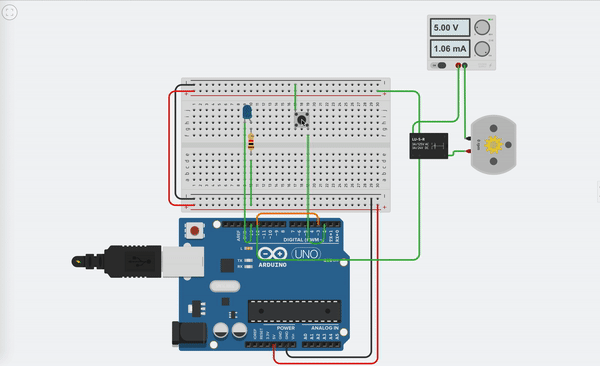

## Motor Feedback Control with Arduino Unp

This demo project shows the simple feedback control system for motor control. 

There is a manual push button switch that will turn on / off the motor. The status of motor is send as feedback sigal to system. So when 
- motor is ON, motor status led will also be on indicating motor is currently running. 
- When motor is off , motor status led is also off indicating motor is in off state.

This feedback system will be handy when motor and monitor system is at different location.




## Code:

- Manual Switch is connected to **pin 2** <br> Manual button pressed is monitor via interrupt mechanism on Falling LOW signal. It means when this pin status changes from HIGH to LOW. ISR function is called.
- Here motor control is connected to **pin 12**
- Motor control feedback in **pin 3** 
- motor current status indicator (LED) in **pin 13** <br> When user press manual switch motor turn on. Additionally this signal is also send back to controller via this pin to indicate the status of motor current state. This will help in remote monitoring of motor and also make us easy to debug if motor is not running even after sending control command.


```c
bool ON = LOW;
bool OFF = HIGH;
bool motorStatus = OFF;
bool motorFeedbackStatus = OFF;
void setup()
{ 
  pinMode(2, INPUT_PULLUP );
  pinMode(3, INPUT_PULLUP );
  attachInterrupt(digitalPinToInterrupt(2), motorOnInstruction, FALLING );
 
  
  pinMode(12, OUTPUT);
  pinMode(13, OUTPUT);
  
  Serial.begin(9600);  
  
  digitalWrite(12, OFF) ;
  digitalWrite(13, OFF) ;
  
}


void motorOnInstruction(){
	motorStatus = !motorStatus;
    Serial.println(motorStatus);
}

void currentMotorStatus(){
  	Serial.print("Motor Status Feedback: ");
	Serial.println(motorStatus ? "OFF" : "ON");
}


void loop()
{
  digitalWrite(12, motorStatus) ;
  if (motorFeedbackStatus != digitalRead(3)){
  	motorFeedbackStatus = digitalRead(3);
    currentMotorStatus();
    digitalWrite(13, motorFeedbackStatus) ;
  }
  
  
}
```
