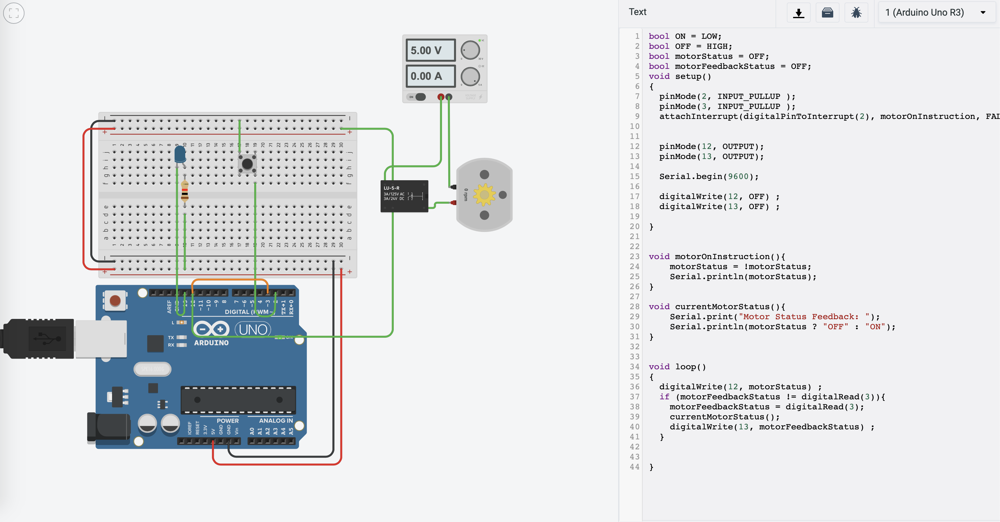

## Motor Feedback Control with Arduino Unp

This demo project shows the simple feedback control system for motor control. 

There is a manual push button switch that will turn on / off the motor. The status of motor is send as feedback sigal to system. So when 
- motor is ON, motor status led will also be on indicating motor is currently running. 
- When motor is off , motor status led is also off indicating motor is in off state.

This feedback system will be handy when motor and monitor system is at different location.

