# Introduction 

Charles is an HTTP proxy / HTTP monitor / Reverse Proxy that enables a developer to view all of the HTTP and SSL / HTTPS traffic between their machine and the Internet. This includes requests, responses and the HTTP headers (which contain the cookies and caching information).

**Normal**
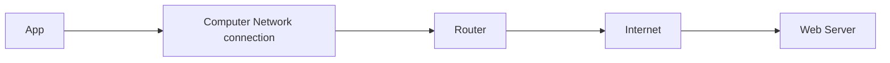

**With Proxy**
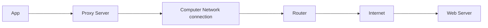

# Installation

Charles Proxy for mac can be downloaded from https://www.charlesproxy.com/download/.  First install and open the charles proxy. On the first lunch, It should ask for permission to automatically configure your network settings. If it doesn’t, press **Command-Shift-P** to manually have Charles ask for this permission.


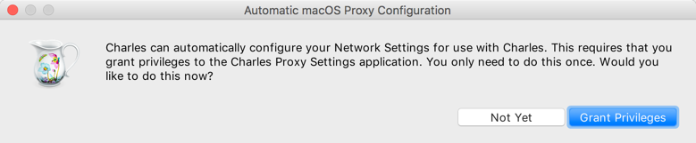

Click **Grant Privileges** and enter your password if prompted. Charles starts recording network events as soon as it launches, so you should already see events popping into the left pane.


# Configure Charles Proxy

### Step 1: View proxy server ip/port and install root certificate

- To get IP Address, Open `Charles Proxy` > `Help` > ` Local IP Address`

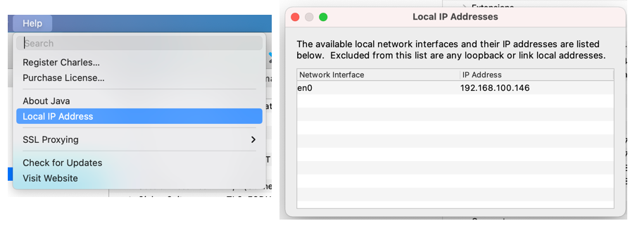

- Deault Port is `8888`, but you can change the port from `Proxy` > `Proxy Setting` > 

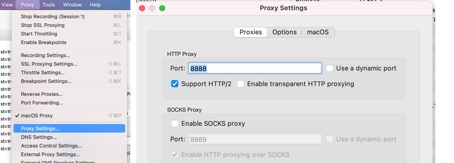

- To install root certitiface
    - Go to `help` > `SSL Proxying` > `Install Charles Root Certificate`
    - This  will install Charles root certificate. 
    - Open `Keychain` and search `charles certificate`  and trust this certifite for always.


### Step 2: Configure your mobile device to use charles proxy

- **For iOS Device**
    - `Setting` > `Wifi` > `Choose your newtork wifi` > `select more` > `Proxy` > `Manual` 
    - Enter the IP and port you get for charles proxy
    - Save 
    - This will restart the wifi connection and you are good to go.

<br>

- **For iOS Simulator**
    - By default iOS simulator uses Mac OS network connection. 
    - Go to ` charles proxy ` >  enable `Mac OS Proxy`
    - 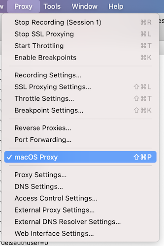
<br>  


- **For Androud Device**
    - `Setting` > `Wifi` > `Press and Hold your wifi network` > `select modify` > `Proxy` > `Manual` 
    - Enter the IP and port you get for charles proxy
    - Save 
    - This will restart the wifi connection and you are good to go.

<br>

- **For Android Emulator**
    - There are two ways you can configure proxy for android emulator
    - Method 1 
        - list available android vertual devices `android avd`
        - Start your your emulator with `- http-proxy` command
        - `emulator @Pixel_3a_API_30 -http-proxy 192.168.100.146:8888`
    
    - Method 2
        - Select `...` button at the bottom right corner > `Setting` > `proxy` 
        - Enter the ip and port 
        


### Step 3: View network traffic

At this moment if you open browser in your mobile device and surf website you will start receiving network traffic in charles proxy. `HTTP` traffice are by default in plane text. But `HTTPS` traffice are encoded and cannot be read. The traffice that are encoded is marked with `lock` icon and http  traffice are marked `

 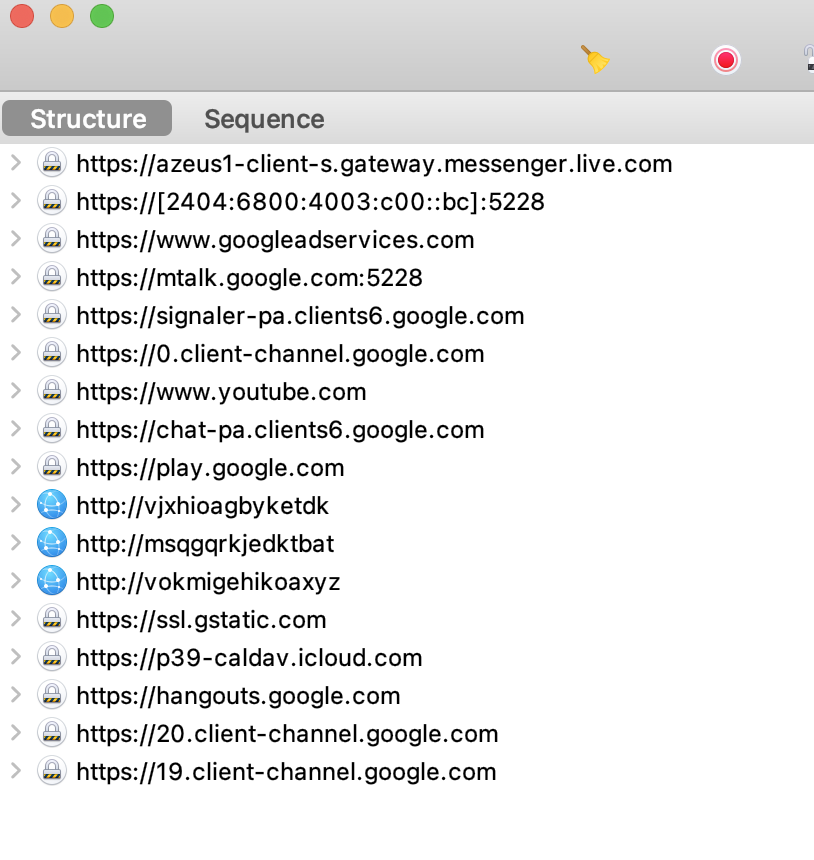

In order to view `https traffice` we need to configure charles proxy to use `SSL proxying`

- `Proxy` > `SSL Proxy Setting` > `Enable SSL Proxying`
- You also need to add specific host to start proxying
- You can use `*.*` to start proxying all newtork traffic.

 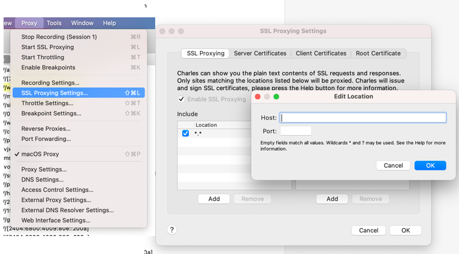

Now if you look at the traffice in charles you will see `lock icon` now changed to `flash icon` or `globe icon`. But in this case case also if you look at the resource url, ut us marked unknown. Thats because charlse is acting as trust authority but device does not trust this authority. So we need to install charles root certificate to device as well. 

 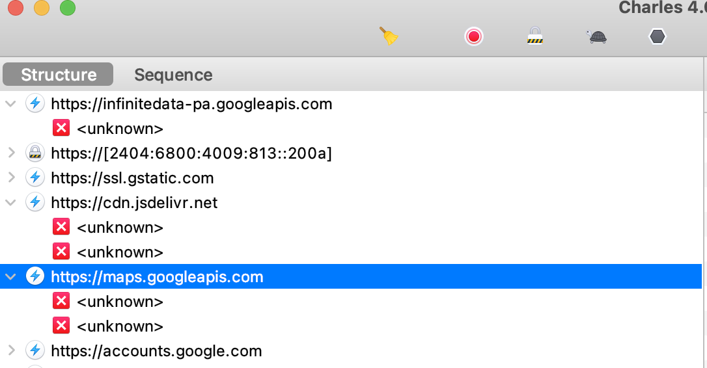


### Step 4: Install Charles Root Certificate in Mobile Devie

First go to `Charles` -> `Help` -> `SSL Proxying` -> `Install Charles Root Certificate on Mobile Device or Remote Browser` . This will some information on where to get the charles ca certificate.

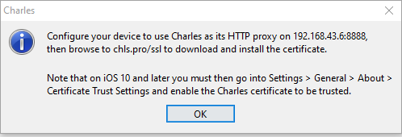


- **For iOS Device**
    - Ensure that iOS Device is using proxy ip / port in wifi configuration
    - `Open safari` > enter `https://chlr.pro/ssl`
    - New certificate is downloaded into your device
    - To install goto `Setting`> `General` > `Profiles` and install the profile.
    - From iOS 10 or later, we need to manually trust the install certificate.  
    - For this goto `Setting` > `General` > `About` > `Certificate Trust Settings` > `Enable Trust` for charles certificate.
    <br>
    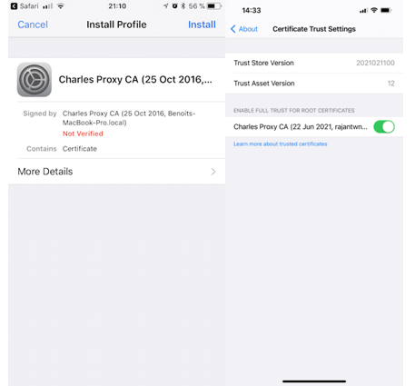
    - That's it for iOS Device.  Now you will be able to see the decrypted 

- **For iOS Simulator**   
    - Quit your iOS Simulator. 
    - Launch `Charles` > `Help menu` > Choose the `SSL Proxying` > `Install Charles Root Certificate in iOS Simulators`
    - This will install your Charles Root Certificate into all of your iOS Simulators.
     Now when you start the iOS Simulator, you should be able to access SSL websites with Charles using SSL Proxying.
    

- **For Android Device**
    - Open `Chrome Browser` and goto `https://chlr.pro/ssl`.
    - This will download the Charles CA certificate into download folder. 

    - On newer versions of Android, you may get an error on downloading, such as "download unsuccessful". If this happens, use the following instructions:
        - Go to `Help` > `SSL Proxying` > `Save Charles Root Certificate`.

        - Transfer the `certificate` file to your device using an SD Card, USB Cable, or remote transfer such as Google Drive.
        - Now in your android device open `Setting` > `Security` > `Advance` > `Encryption & Credentials` > `Install a Certificate` > `VPN & Apps`.
        - Name the certificate and okay it as a trusted certificate.
        - Once the certificate is installed, you are prompted to set up a PIN.

One other method to download certificate is by entering following into brower

```
data:text/html,<a href=http://www.charlesproxy.com/getssl/>Save This Link
```


**Note: Above process works below android N (Android 7)**

As of Android N, you need to add configuration to your app in order to have it trust the SSL certificates generated by Charles SSL Proxying. This means that you can only use SSL Proxying with apps that you control.

In order to configure your app to trust Charles, you need to add a Network Security Configuration File to your app. This file can override the system default, enabling your app to trust user installed CA certificates (e.g. the Charles Root Certificate). You can specify that this only applies in debug builds of your application, so that production builds use the default trust profile.

Add a file res/xml/network_security_config.xml to your app:

```xml
<network-security-config> 
  <debug-overrides> 
    <trust-anchors> 
      <!-- Trust user added CAs while debuggable only -->
      <certificates src="user" /> 
    </trust-anchors> 
  </debug-overrides> 
</network-security-config>
```

Then add a reference to this file in your app's manifest, as follows:

```xml
<?xml version="1.0" encoding="utf-8"?>
<manifest ... >
    <application android:networkSecurityConfig="@xml/network_security_config" ... >
        ...
    </application>
</manifest>
```


# Modifying the Response

Time to have some fun and change the data before the app gets it. Can you get the app to break or act funny?

In Charles, right-click the request within the Sequence list, and click Breakpoints in the pop-up list. Then, click Proxy ▸ Breakpoint Settings, double-click the breakpoint you added and make sure to empty Query:

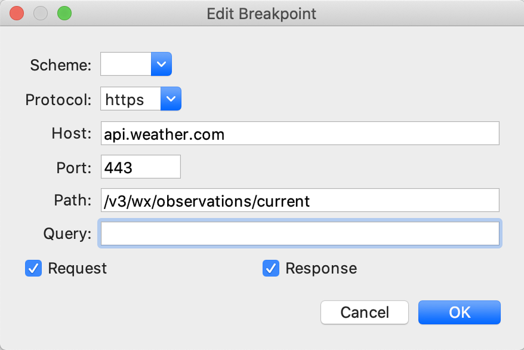

This ensures you intercept any request containing this path, regardless of the query parameters, and Charles will pause and let you edit both the request and response.

Again on your device, pull down to refresh the app.

A new tab titled Breakpoints should pop up with the outgoing request. Click Execute without modifying anything. A moment later, the Breakpoints tab should again reappear with the response.

Click the Edit Response tab near the top. At the bottom, select JSON text. Scroll down and find temperature and change its value to something unrealistic like 98000. Click Execute.


98000°F is incredibly hot! It seems like the app doesn’t adjust the font size for temperatures with more than five digits. That’s a definite one-star rating. ;]

Back in Charles, delete the breakpoint you set by going to Proxy ▸ Breakpoint Settings.

Uncheck the entry for api.weather.com to temporarily disable it, or highlight the row and click Remove to delete it. Pull down to refresh, and the temperature should return to normal.

**Refrrences**

- https://www.charlesproxy.com/documentation/using-charles/ssl-certificates
- https://www.raywenderlich.com/21931256-charles-proxy-tutorial-for-ios#toc-anchor-014
