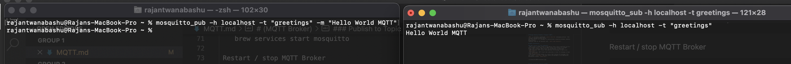
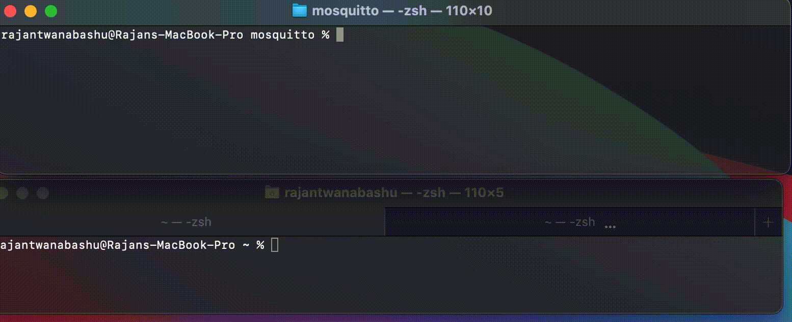

# Message Queuing Telemetry Transport (MQTT)

`MQTT` is extremely lightweight `pubish subscribe` messaging protocol  that transport message between device 
over the TCP/IP that run over `port 1883 for plain MQTT and 8883 for MQTT over TLS`. It is desiggn for bidirectional connection between remotely placed device 
(specialy used for iOT devices) with  `small code footprint`.

## MQTT Architecture

### MQTT consist of 4 key components
- MQTT Client: An MQTT client is any device (from a micro controller up to a full-fledged server) that runs an MQTT library and connects to an MQTT broker over a network. MQTT client can be Publisher or Subscriber.
- MQTT Publisher: MQTT Client that publishes the message to topic on an `MQTT Broker`.
- MQTT Subscriber: MQTT Client that subscribe or lister for message on topic from `MQTT Broker`
- MQTT Broket: An MQTT broker is a server that receives all messages from the clients `[Publisher]` and then routes the messages to the appropriate destination clients `[Subscriber]`.

## Some of the key features of MQTT 

### Lightweight and Efficient

MQTT clients are very small, require minimal resources so can be used on small microcontrollers. MQTT message headers are small to optimize network bandwidth.

### Bi-directional Communications

MQTT allows for messaging between device to cloud and cloud to device. This makes for easy broadcasting messages to groups of things.

### Scale to Millions of Things

MQTT can scale to connect with millions of IoT devices.

### Reliable Message Delivery

Reliability of message delivery is important for many IoT use cases. This is why MQTT has 3 defined quality of service levels: 0 - at most once, 1- at least once, 2 - exactly once

### Support for Unreliable Networks

Many IoT devices connect over unreliable cellular networks. MQTT’s support for persistent sessions reduces the time to reconnect the client with the broker.

### Security Enabled

MQTT makes it easy to encrypt messages using TLS and authenticate clients using modern authentication protocols, such as OAuth.

# (MQTT Broker)

There are lots of MQTT Broker available, but we are going to use `Eclipse Mosquitto`. 

 

[Official Documents](https://mosquitto.org)

Eclipse Mosquitto is an open source (EPL/EDL licensed) message broker that implements the MQTT protocol versions 5.0, 3.1.1 and 3.1. Mosquitto is lightweight and is suitable for use on all devices from low power single board computers to full servers.

The MQTT protocol provides a lightweight method of carrying out messaging using a publish/subscribe model. This makes it suitable for Internet of Things messaging such as with low power sensors or mobile devices such as phones, embedded computers or microcontrollers.

The Mosquitto project also provides a C library for implementing MQTT clients, and the very popular mosquitto_pub and mosquitto_sub command line MQTT clients.

### Installation

 
For Mac OSX 

    brew install mosquitto

Start MQTT broker on lunch

    brew services start mosquitto

 Restart / stop MQTT Broker   

    brew services restart mosquitto

    brew services stop mosquitto

MQTT Configuration file

    cd /usr/local/etc/mosquitto/mosquitto.conf 

 ### Subscribe to Topic 

    mosquitto_sub -h [host] - t [topic]  

    mosquitto_sub -h localhost - t greeetings   

 ### Publish to Topic

    mosquitto_pub -h [host] -t [topic] -m [message]

    mosquitto_pub -h localhost -t greeetings -m "Hello world MQTT"

### Debug MQTT Publisher

We can use `-d` flag to see the debug message while sending the mqtt message

    mosquitto_pub -h localhost -t greeetings -m "Hello world MQTT" -d

    //Debug message
    Client mosq-ZaL9mzWA7K78ubUN2a sending CONNECT
    Client mosq-ZaL9mzWA7K78ubUN2a received CONNACK (0)
    Client mosq-ZaL9mzWA7K78ubUN2a sending PUBLISH (d0, q0, r0, m1, 'greetings', ... (16 bytes))
    Client mosq-ZaL9mzWA7K78ubUN2a sending DISCONNECT

## MQTT Authentication

By default mqtt broke allow anonymous user to receive the message being published. These settings are configured in `mosquitto.cong` as

> allow_anonymous true

But Mosquitto broker can be configured to allow client authentication using username and password before connection is performed. The username and password is transmitted in plain text unless we use secure transport encryption.

**Configuring user authentication**

[Refrence Resources](http://www.steves-internet-guide.com/mqtt-username-password-example/)

- Method 1: From text file.
  - Create a file **auth.txt** 
    - `nano auth.txt`
  - Enter username and password seperated by colon. 
    - `rajan:password123`
  - To create additional user enter username and password in new line.
  - Now encrypt the auth.txt file before we actually use it with `mosquitto_passwd` utility
    - `mosquitto_passwd -U auth.txt`
    - This will update the plain text auth.txt and encrypt the password
    - `rajan:$6$dtMF49Z2e8YSrYEY$1nAtPhU4V+d8dj/3glka5H7VrQBf/IZ2WFhJDQI5CGpbK6soFrwk0cciOf0pioSvkTsiZ9rD24pOZTPpYxq1Kg==`

- Method 2: Direct Method.
  - Use mosquitto_passwd to  generate encrypted username and password file
    - `mosquitto_passwd -c auth.text rajan`
    - This will create  a auth.txt file with username = rajan and ask for pasword to enter.

## Using the Password file

In mac you will need to copy the password file `auth.txt` to the directory where `mosquitto.conf` exists. Normaly it under `/usr/local/etc/mosquitto`. We then need to change two setting in mosquitto.conf file. 

- Don't allow anonymous to connect
  - `allow_anonymous false`
- Set the password file to use auth.txt
  - `password_file /usr/local/etc/mosquitto/auth.txt`
- and restart the mqtt broker
  - `brew services restart mosquitto`

### Authentiation for Subscription

From now on we need to use username and password to be able to connect to MQTT Broker. Otherwise we will get `Error: Connection refused`

     //To subscribe
     mosquitto_sub -h localhost -u "rajan" -P "password123"  -t "greetings"

     //To Publish
     mosquitto_pub -h localhost -t "greetings" -m "Hello World MQTT" -u rajan -P password123  -d

## MQTT Retain

[Refrence Document](http://www.steves-internet-guide.com/mqtt-retained-messages-example/)

Normally if a publisher publishes a message to a topic, and no one is subscribed to that topic the message is simply discarded by the broker.
However the publisher can tell the broker to keep the last message on that topic by setting the retained message flag. 

Without retained messages the subscriber would have to wait for the status to change before it received a message. However with the retained message the subscriber would see the current state of the sensor. What is important to understand is that only one message is retained per topic.

     mosquitto_pub -h localhost -t "greetings" -m "Hello World MQTT" -u rajan -P password123  -d -r 

Here `-r` speficy tells the broker to retain the message.

## MQTT SSL/TLS Security

[Refrence Resource](http://www.steves-internet-guide.com/mosquitto-tls/)
[Refrence Resource](https://support.asplhosting.com/t/how-to-send-and-receive-messages-with-mosquitto-sub-and-mosquitto-pub-to-myqtthub-com/34)