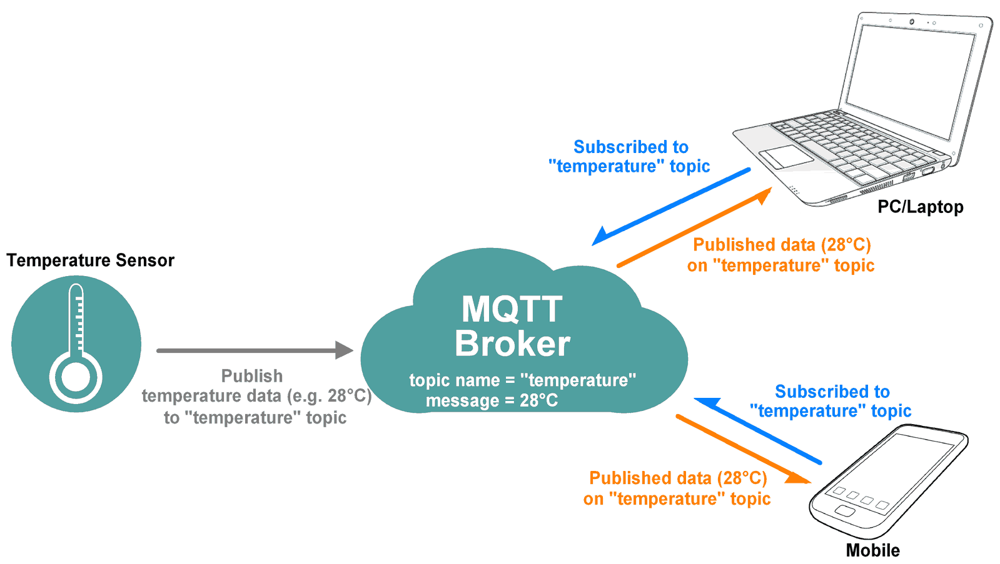

# Message Queuing Telemetry Transport (MQTT)

`MQTT` is extremely lightweight `pubish subscribe` messaging protocol  that transport message between device 
over the TCP/IP. It is desiggn for bidirectional connection between remotely placed device 
(specialy used for iOT devices) with  `small code footprint`.

## MQTT Architecture

### MQTT consist of 4 key components
- MQTT Client: An MQTT client is any device (from a micro controller up to a full-fledged server) that runs an MQTT library and connects to an MQTT broker over a network. MQTT client can be Publisher or Subscriber.
- MQTT Publisher: MQTT Client that publishes the message to topic on an `MQTT Broker`.
- MQTT Subscriber: MQTT Client that subscribe or lister for message on topic from `MQTT Broker`
- MQTT Broket: An MQTT broker is a server that receives all messages from the clients `[Publisher]` and then routes the messages to the appropriate destination clients `[Subscriber]`.

## Some of the key features of MQTT 

### Lightweight and Efficient

MQTT clients are very small, require minimal resources so can be used on small microcontrollers. MQTT message headers are small to optimize network bandwidth.

### Bi-directional Communications

MQTT allows for messaging between device to cloud and cloud to device. This makes for easy broadcasting messages to groups of things.

### Scale to Millions of Things

MQTT can scale to connect with millions of IoT devices.

### Reliable Message Delivery

Reliability of message delivery is important for many IoT use cases. This is why MQTT has 3 defined quality of service levels: 0 - at most once, 1- at least once, 2 - exactly once

### Support for Unreliable Networks

Many IoT devices connect over unreliable cellular networks. MQTT’s support for persistent sessions reduces the time to reconnect the client with the broker.

### Security Enabled

MQTT makes it easy to encrypt messages using TLS and authenticate clients using modern authentication protocols, such as OAuth.

# (MQTT Broker)

There are lots of MQTT Broker available, but we are going to use `Eclipse Mosquitto`. 

 

[Official Documents](https://mosquitto.org)

Eclipse Mosquitto is an open source (EPL/EDL licensed) message broker that implements the MQTT protocol versions 5.0, 3.1.1 and 3.1. Mosquitto is lightweight and is suitable for use on all devices from low power single board computers to full servers.

The MQTT protocol provides a lightweight method of carrying out messaging using a publish/subscribe model. This makes it suitable for Internet of Things messaging such as with low power sensors or mobile devices such as phones, embedded computers or microcontrollers.

The Mosquitto project also provides a C library for implementing MQTT clients, and the very popular mosquitto_pub and mosquitto_sub command line MQTT clients.

### Installation

 
For Mac OSX 

    brew install mosquitto

Start MQTT broker on lunch

    brew services start mosquitto

 Restart / stop MQTT Broker   

    brew services restart mosquitto
    
    brew services stop mosquitto
