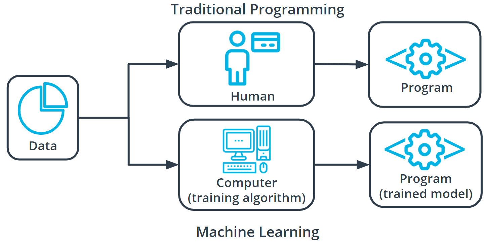
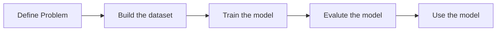

# Introduction

`Machine Learning (ML)` is a mordern software development technique that enables computer to lean and impprove from experence without being explicitly programmed to do so and solve the new problem by using the sets of real world data sets. It is a part of broader field of `Articifical Intelligence AI`. `AI` is a field concerned with capability of machine to perform activities using human-like intelligence.  In short by machine learning computers can 

- learn from data
- discover patterns
- and make predection

### Understanding Terminology

Machine learning is a new field created at the intersection of `statistics`, `applied math`, and `computer science`. Because of the rapid and recent growth of machine learning, each of these fields might use slightly different formal definitions of the same terms.

There are many types of `Machine Learning`  algorithm. Some of them are as below

- `Supervised Learning`: 
        
    In this type of algorithm every sample data from train model have it corresponding output or label. Hence it can be use to predict the output value for specific inputh. 

- `Unsupervised Learning`
    
    In `unsupervised learning` there is no label for the sample data. Machine itself tries to learn the underline patterns and distrbution that govern the data.

- `Reinforcement Learning`

    The `reincorcement learning` takes a different approach  than supervised, unsupervised learning. This type of algorithm figure out which action to take in a situation to maximize rewards while acheiving the goal.

    eg. This is very much similar to how we train your dog. We treat the dog if it does what you want to do or if the dog do what you don't want it to do then we might want to give it a penalty such as raising voice of punishment.  Thats how your does tries to do that gets reward and avoid those that result in penalty.
     

### How does machine learning differ from traditional programming-based approaches ?

In traditional problem-solving with software, a person analyzes a problem and engineers a solution in code to solve that problem. For many real-world problems, this process can be laborious (or even impossible) because a correct solution would need to consider a vast number of edge cases.

Imagine, for example, the challenging task of writing a program that can detect if a cat is present in an image. Solving this in the traditional way would require careful attention to details like varying lighting conditions, different types of cats, and various poses a cat might be in.

In machine learning, the problem solver abstracts away part of their solution as a flexible component called a model, and uses a special program called a model training algorithm to adjust that model to real-world data. The result is a trained model which can be used to predict outcomes that are not part of the data set used to train it.

In a way, machine learning automates some of the statistical reasoning and pattern-matching the problem solver would traditionally do.

The overall goal is to use a model created by a model training algorithm to generate predictions or find patterns in data that can be used to solve a problem.

# Component of Machine Learning

- Machine Learning Model
  - Machine learning model is extremely generic block of code or framework that can be modified to solve different but related problems based on the data provided.
  
- Model Training Algorithm
  - Model training algorithms work through an interactive process where the current model iteration is analyzed to determine what changes can be made to get closer to the goal. Those changes are made and the iteration continues until the model is evaluated to meet the goals.

- Model Interface Algorithm
  - Model inference is when the trained model is used to generate predictions.

# Introduction to the Five Machine Learning Steps

Regardless of the specific model or training algorithm used, machine learning practitioners practice a common workflow to accomplish machine learning tasks.

