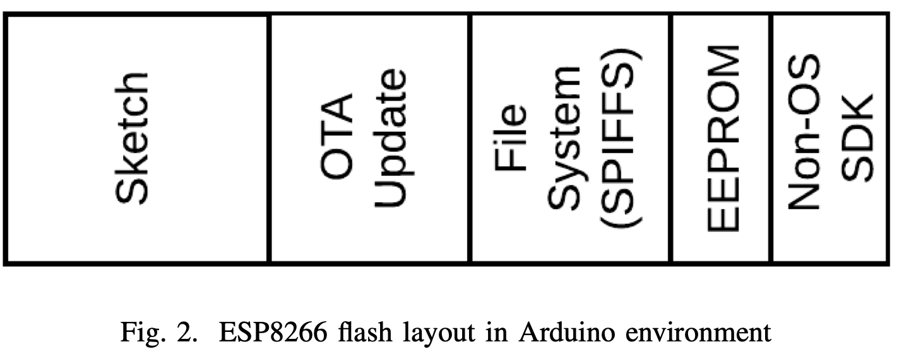

# Saving Data in NodeMCU - ESP8266

There are two ways to store data on ESP8266.
- using internal EEPROM which is of 512 Bytes.
- using SPI Flash which is of 64kBytes to 3Mbyte.

These write operation are limited to certain count around 10000 times.
  

 

<br>
<br>

# Method 1: Using (ESP8266) EEPROM

ESP8266 have 512 bytes of internal EEPROM, it is useful when you want to store some settings, such as IP address of server, WEP key, SSID of WiFi.
You need to call EEPROM.begin(size) before you start reading or writing, size being the number of bytes you want to use. Size can be anywhere between 4 and 4096 bytes.
EEPROM.write does not write to flash immediately, instead you must call EEPROM.commit() whenever you wish to save changes to flash.
EEPROM.end() will also commit, and will release the RAM copy of EEPROM contents.

<br>

## Write to EEPROM

### To save character


        int addr = 0;  //Address to write character in EEEPROM
        EEPROM.begin(512); //Initialize EEPROM 512 bytes
        EEPROM.write(addr, data);
        EEPROM.commit();

To save strings of character

        EEPROM.begin(512); //Initialize EEPROM 512 bytes
        String sample = "Hello World";
        for (int i = 0; i < sample.length(); i++)
        {
            EEPROM.write(0x0F + i, sample[i]); //Write one by one with starting address of 0x0F
        } 
        EEPROM.commit(); //Store data to EEPROM

<br>

## Read from EEPROM    

### Read character
The arduino and ESP8266 EEPROM library only provides functions to read and write one byte at a time from the internal EEPROM. Note that EEPROM has limited number of writes.
String is basically character array terminated with null (0x00).

> | H | E | L | L | o | \0 |

<br>

 
        int addr = 0;  //Address to write character in EEEPROM
        EEPROM.begin(512); //Initialize EEPROM 512 bytes
        Char data = EEPROM.read(addr);
        

Read Strings of characters

    EEPROM.begin(512); //Initialize EEPROM 512 bytes 

    String strText;
    for (int i = 0; i < 11; i++)   // Hello World =  11 characters
    {
        strText = strText + char(EEPROM.read(0x0F + i)); //Read one by one with starting address of 0x0F
    }

    Serial.println(strText); //Print the text


## Clear EEPROM

Sets all of the bytes of the EEPROM to 0.

    EEPROM.begin(512);
    // write a 0 to all 512 bytes of the EEPROM
    for (int i = 0; i < 512; i++) {
     EEPROM.write(i, 0);
    }
    EEPROM.end();

<br>
<br>

# Using SPI Flash

File system is stored on the same flash chip as the program, programming new sketch will not modify file system contents. This allows to use file system to store sketch data, configuration files, or content for Web server.


### Write to file

```c
#include <FS.h>

void writeIntoFile()
{
  //Initialize File System
  if (SPIFFS.begin())
  {
    Serial.println("SPIFFS Initialize....ok");
  }
  else
  {
    Serial.println("SPIFFS Initialization...failed");
  }

  //Format File System
  if (SPIFFS.format())
  {
    Serial.println("File System Formated");
  }
  else
  {
    Serial.println("File System Formatting Error");
  }

  //Create New File And Write Data to It
  //w=Write Open file for writing
  File f = SPIFFS.open("config.json", "w");

  if (!f)
  {
    Serial.println("file open failed");
  }
  else
  {
    //Write data to file
    Serial.println("Writing Data to File");
    f.print("This is sample data which is written in file");
    f.close(); //Close file
  }
}


```


### Read from file

```c
void readFromFile()
{
  int i;

  //Read File data
  File f = SPIFFS.open("config.json", "r");

  if (!f)
  {
    Serial.println("file open failed");
  }
  else
  {
    Serial.println("Reading Data from File:");
    //Data from file
    for (i = 0; i < f.size(); i++) //Read upto complete file size
    {
      Serial.print((char)f.read());
    }
    f.close(); //Close file
    Serial.println("File Closed");
  }
}
```

### Uses

```c

void setup()
{
  Serial.begin(115200);
  writeIntoFile();
}

void loop()
{ 
  readFromFile();
}

```

### Output
        File System Formated
        Writing Data to File

        Reading Data from File:
        This is sample data which is written in fileFile Closed
        