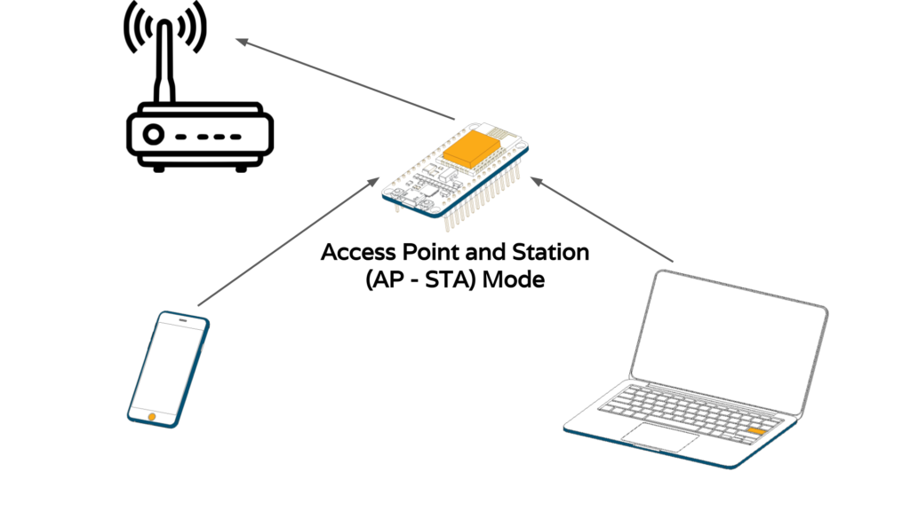

# Connect to Wifi Network

## WiFi Mode : WIFI_STA (Station)

<br>

[Official Documentation](https://arduino-esp8266.readthedocs.io/en/latest/esp8266wifi/station-class.html)

<br>


Devices that connect to Wi-Fi networks are called stations (STA). Connection to Wi-Fi is provided by an access point (AP), that acts as a hub for one or more stations. The access point on the other end is connected to a wired network. An access point is usually integrated with a router to provide access from a Wi-Fi network to the internet. Each access point is recognized by a SSID (Service Set IDentifier), that essentially is the name of network you select when connecting a device (station) to the Wi-Fi.

ESP8266 modules can operate as a station, so we can connect it to the Wi-Fi network.


### Dynamic IP Mode

```c++
#include <Arduino.h>
#include <ESP8266WiFi.h>

void connectToNetwork(char *ssid, char *password)
{
  WiFi.mode(WIFI_STA); //configure as stations that connect to wifi network.

  WiFi.begin(ssid, password);
  while (WiFi.status() != WL_CONNECTED)
  {
    delay(500);
    Serial.print(".");
  }
  Serial.println("");
  Serial.println("WiFi connected with following info");

  Serial.printf(" Wifi SSID: %s\n Wifi PSK: %s\n Wifi AP MAC Address: %s\n RSSI: %d dBm\n", WiFi.SSID().c_str(), WiFi.psk().c_str(), WiFi.BSSIDstr().c_str(), WiFi.RSSI());
  Serial.printf(" DNS #1: %s, DNS #2: %s\n", WiFi.dnsIP().toString().c_str(), WiFi.dnsIP(1).toString().c_str());
  Serial.printf(" IP Address: %s\n Gataway IP: %s\n Subnet mask: %s\n", WiFi.localIP().toString().c_str(), WiFi.gatewayIP().toString().c_str(), WiFi.subnetMask().toString().c_str());
};

};

void setup()
{
 
  Serial.begin(115200);
  // Serial.setDebugOutput(true);
  connectToNetwork(STASSID, STAPSK);
}

void loop()
{
 
}

```

### For Static IP

We can use `Wifi.begin(ip, gateway, subnet, dns)`  to configure static ip for esp8266 wifi module. Add Following line of code before Wifi.begin()

```c
  ........

  IPAddress local_IP(192, 168, 100, 111);
  IPAddress gateway(192, 168, 100, 1);
  IPAddress subnet(255, 255, 255, 0);
  WiFi.config(local_IP, gateway, subnet);

  WiFi.begin(ssid, password);

  .....................
```


<br>
<br>

### Connecting to strongest wifi network. 

It is posssible provide multiple wifi configuration and connect to strongest one via esp8266 module. We can use `ESP8266WiFiMulti` for this.

```c++

void setup(){

//create an instance of ESP8266WiFiMulti 
  ESP8266WiFiMulti wifiMulti;
  
  // add Wi-Fi networks you want to connect to
  wifiMulti.addAP("ssid_from_AP_1", "your_password_for_AP_1");  
  wifiMulti.addAP("ssid_from_AP_2", "your_password_for_AP_2");
  wifiMulti.addAP("ssid_from_AP_3", "your_password_for_AP_3");
  
  Serial.println("Connecting ...");
  int i = 0;
  while (wifiMulti.run() != WL_CONNECTED) { // Wait for the Wi-Fi to connect: scan for Wi-Fi networks, and connect to the strongest of the networks above
    delay(250);
    Serial.print('.');
  }
  Serial.println('\n');
  Serial.print("Connected to ");
  Serial.println(WiFi.SSID());              // Tell us what network we're connected to
  Serial.print("IP address:\t");
  Serial.println(WiFi.localIP());  
  
}
```


## Soft Access Point or WiFi Mode (WIFI_AP)

An access point (AP) is a device that provides access to a Wi-Fi network to other devices (stations) and connects them to a wired network. The ESP8266 can provide similar functionality, except it does not have interface to a wired network. Such mode of operation is called soft access point (soft-AP). The maximum number of stations that can simultaneously be connected to the soft-AP can be set from 0 to 8, but defaults to 4.


### Uses

- The soft-AP mode is often used and an intermediate step before connecting ESP to a Wi-Fi in a station mode. This is when SSID and password to such network is not known upfront. ESP first boots in soft-AP mode, so we can connect to it using a laptop or a mobile phone. Then we are able to provide credentials to the target network. Then, the ESP is switched to the station mode and can connect to the target Wi-Fi.

- Another handy application of soft-AP mode is to set up mesh networks. The ESP can operate in both soft-AP and Station mode so it can act as a node of a mesh network.


### Notes:

- The network established by softAP will have default IP address of 192.168.4.1. This address may be changed using softAPConfig (see below).
Even though ESP8266 can operate in soft-AP + station mode, it actually has only one hardware channel. Therefore in soft-AP + station mode, the soft-AP channel will default to the number used by station. For more information how this may affect operation of stations connected to ESP8266’s soft-AP, please check this FAQ entry on Espressif forum.

<br>

[Documentation](https://arduino-esp8266.readthedocs.io/en/latest/esp8266wifi/soft-access-point-class.html)


### AP Mode in dynamic IP

```c++
#include <Arduino.h>
#include <ESP8266WiFi.h>

#ifndef STASSID
#define STASSID "aarop_wlink"
#define STAPSK "Aa9808907D"
#endif

void configureSoftAP()
{
    String ssid = "NodeMcuAP";
    String psk = "1234567890";
    Serial.print("Setting soft-AP configuration  with default IP ... ");
    WiFi.mode(WIFI_AP);
    if (WiFi.softAP(ssid, psk))
    {
        Serial.println("\n---------- Access Point created -----------");
        Serial.printf("ssid: %s\t %s \n", ssid.c_str(), psk.c_str());
        Serial.printf("IP Address: %s\t MAC Address: %s\n", WiFi.softAPIP().toString().c_str(), WiFi.softAPmacAddress().c_str());
        Serial.println("------------------------------\n");
    }
    else
    {
        Serial.println("---------- Failed to create: Access Point -----------\n");
    }
}

void setup()
{
  Serial.begin(115200);
  configureSoftAP();
}
```

### To get the number of stations connected with this AP

```c++

void loop()
{
  // no of count connected to this ap.
  Serial.printf("Stations connected = %d\n", WiFi.softAPgetStationNum()); 
}

```

### To configure  static IP for AP Mode

```c++
void configureSoftAP()
{
    String ssid = "NodeMcuAP";
    String psk = "1234567890";
    
    IPAddress local_IP(192, 168, 4, 111);
    IPAddress gateway(192, 168, 4, 1);
    IPAddress subnet(255, 255, 255, 0);

    Serial.print("Setting soft-AP configuration  with static IP ... ");
    WiFi.mode(WIFI_AP);
    if (WiFi.softAPConfig(local_IP, gateway, subnet))
    {
        Serial.println("\n---------- Access Point created -----------");
        Serial.printf("ssid: %s\t %s \n", ssid.c_str(), psk.c_str());
        Serial.printf("IP Address: %s\t MAC Address: %s\n", WiFi.softAPIP().toString().c_str(), WiFi.softAPmacAddress().c_str());
        Serial.println("------------------------------\n");
    }
    else
    {
        Serial.println("---------- Failed to create: Access Point -----------\n");
    }
}
```


## NodeMCU as AP and Statiom Simulateneously. WIFI Mode (WIFI_AP_STA)

In this mode node mcu in AP Mode can be use to configure the configuration parameter in private mode. Where as station mode can be use as client to connect to internet to make api calls or socket conections. 



```c++

#include <Arduino.h>
#include <ESP8266WiFi.h>


void cofigureAP_Station(){
    WiFi.mode(WIFI_AP_STA);
    configureSoftAP(); //for ap mode as above
    connectToNetwork(STASSID, STAPSK); //for station mode as above.

}
void setup()
{
  Serial.begin(115200);
  cofigureAP_Station();
}

void loop()
{
  Serial.printf("Stations connected = %d\n", WiFi.softAPgetStationNum());
}

```