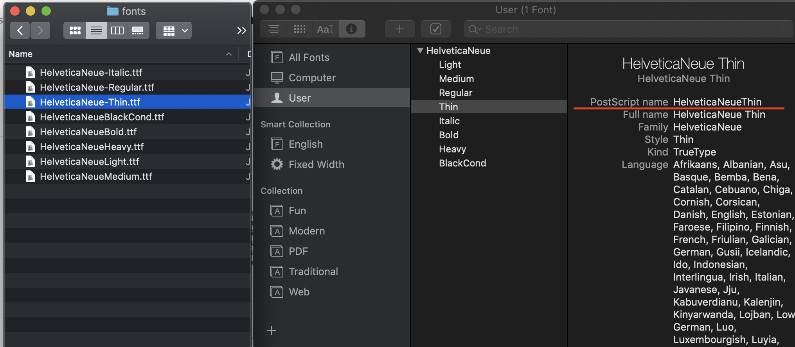

# React Native Custom Fonts

While using custom font in react native we first need to understand how android and iOS handle font name system wide. 
* In android name of font is same as font's file name.
* In iOS name of font is taken from `postscriptname`

For eg.
* I have font file with name `HelveticaNeue-Thin.ttf`
* But if we look at the `Font Book` app in mac it shows `HelveticaNeueThin` for `PostScript Name`




### Cross platform font name convension

To avoid conditional logic in your React Native styles it’s a good plan to rename a font similar to name provided in 
`PostScript Name` if necessary to ensure it is read the same on both iOS and Android.

That is change the font file name to `HelveticaNeueThin.ttf`


## Add Fonts to Assets

- Create a folder called `assets' in root folder of react native project
- Inside `assets` folder create `fonts` folder
- Put all your fonts files in `assets/fonts` folder

### Tell React Native about font location

We do this by adding rnpm to package.json providing the path to the font files.

```json
"rnpm": {
    "assets": [
	"./assets/fonts/"
    ]
}
```

Then run following command to link font files

> react-native link 

This should add the font references in your `Info.plist` file for iOS and on Android copy the font files to 
android/app/src/main/assets/fonts.

Your Info.plist file should have

```xml
<key>UIAppFonts</key>
	<array>
		<string>HelveticaNeueThin.ttf</string>
	</array>
```


