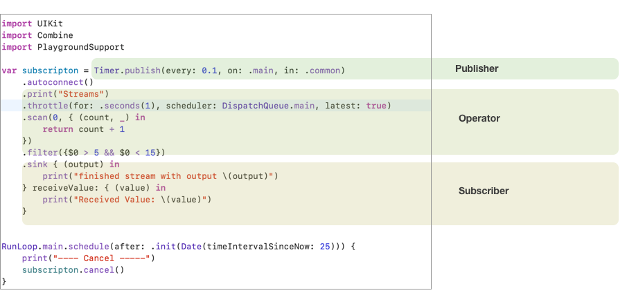

# Introduction

The Combine framework provides a declarative Swift API for processing values over time. These values can represent many kinds of asynchronous events. 
Combine declares publishers to expose values that can change over time, and subscribers to receive those values from the publishers.

- **The Publisher**

   The publisher protocol declares a type that can deliver a sequence of values over time. Publishers have operators to act on the values received from upstream 
   publishers and republish them.

- **The Subscriber**

  A Subscriber instance receives a stream of elements from a Publisher.
  
  
### Basic intro to combine framework.
  
  

  
  In above example we are demonstrating a 
  
  - Timer publisher that publish a value each 10 ms.
  - Publisher operator that receives each streams of input and modifies, then republish the modified values
  - And finally a subscriber that receives the stream of input.
 
 Lets breakdown the above example in more simple way
 
 > Step1
