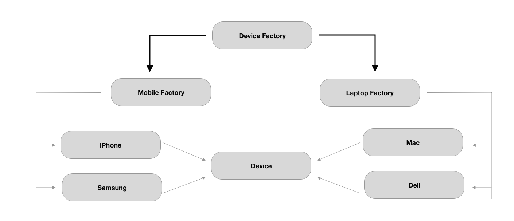

# Abstract Design Pattern

The abstract factory pattern provides a way to encapsulate a group of individual factories that have a common theme without specifying their concrete classes. It is also terms as factory of factory.

Here's the example. We need to create factory that produces Laptop and mobile. Both of them share common properties but are totally different in the end user experience. Here's how abstract factory pattern make it easy to work with.



```swift

protocol Device {
    var ram: String {get set}
    var processor: String {get set}
    func configuration()
}

class Mac: Device {
   
    var ram: String
    var processor: String
    var keyboardLanguage: String //keyboardLanguage is additional properties in Laptop type
    
    init(ram: String, processor: String, keyboardLanguage:String) {
        self.ram = ram
        self.processor = processor
        self.keyboardLanguage = keyboardLanguage
    }
    
    func configuration(){
        print("RAM: \(ram) Processor: \(processor) keybboard Language: \(keyboardLanguage)")
    }
}

class Dell: Device {
    var ram: String
    var processor: String
    var keyboardLanguage: String //keyboardLanguage is additional properties in Laptop type
    
    init(ram: String, processor: String, keyboardLanguage:String) {
        self.ram = ram
        self.processor = processor
        self.keyboardLanguage = keyboardLanguage
    }
    func configuration(){
        print("RAM: \(ram) Processor: \(processor) keybboard Language: \(keyboardLanguage)")
    }
}


class iPhone: Device {
    var ram: String
    var processor: String
   var networkType: String //networkType is additional properties in Laptop type
    
    init(ram: String, processor: String, networkType:String) {
        self.ram = ram
        self.processor = processor
        self.networkType = networkType
    }
    
    func configuration(){
        print("RAM: \(ram) Processor: \(processor) Network Type: \(networkType)")
    }
}

class Samsung: Device {
    var ram: String
    var processor: String
   var networkType: String //networkType is additional properties in Laptop type
    
    init(ram: String, processor: String, networkType:String) {
        self.ram = ram
        self.processor = processor
        self.networkType = networkType
    }
    
    func configuration(){
        print("RAM: \(ram) Processor: \(processor) Network Type: \(networkType)")
    }
}


enum DeviceType {
    case dell,mac,iphone ,samsung
}
protocol FactoryProtocol {
    
    func device(of type:DeviceType )->Device?
}

class LaptopFactory: FactoryProtocol {

    func device(of type: DeviceType)->Device?{
        switch type {
        case .dell:
            return Dell(ram: "8 GB", processor: "Intel", keyboardLanguage: "English")
        case .mac:
            return  Mac(ram: "16 GB", processor: "Apple Silicon", keyboardLanguage: "Nepali")

        default:
            return nil
            
        }
    }
}

class MobileFactory:FactoryProtocol {
    

     func device(of type: DeviceType)->Device?{
        switch type {
        case .iphone:
            return iPhone(ram: "8 GB", processor: "Intel", networkType:"GSM")
        case .samsung:
            return  Samsung(ram: "16 GB", processor: "Apple Silicon", networkType: "CDMA")

        default:
                return nil
                
            }

    }
}

class DeviceFactory{
    enum FactoryType {
        case laptop, mobile
    }

    static func factory(of type: FactoryType)-> FactoryProtocol{
        switch type {
        case .laptop:
            return LaptopFactory()
        case .mobile:
            return MobileFactory()

        }
    }
}

let iphone = DeviceFactory.factory(of: .mobile).device(of: .samsung)
iphone!.configuration()


```


