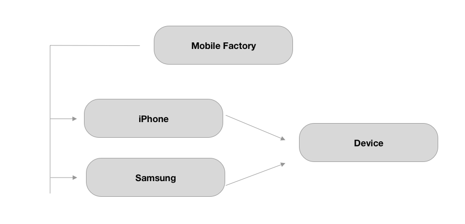

# Factory Design Pattern

Factory design pattern is a type of creational pattern which creates variety of similar objects but hide the logic behind object creation. Such object are related to each other either by sharing common parent class or conform to same protocol. The factory object contains all the logic that allows it to instantiate the correct object to return to the caller.

Generally factory method consist of satic method that instantiate the variety of differnt object from same family.



### Problem identification 

Below is the code sample that demonstrate the Laptop creation without using factory method. 

<br>

### Example 1

```swift
protocol Laptop {
    var ram: String { get set }
    var processor: String { get set }
    func configuration()->String
}


class HP: Laptop {
    var ram: String
    var processor: String
    
    init(ram: String, processor: String) {
        self.ram = ram
        self.processor = processor
    }
    func configuration()->String {
        return "ram: \(self.ram) processor: \(processor)"
    }
}

class Dell: Laptop {
    var ram: String
    var processor: String
    
    init(ram: String, processor: String) {
        self.ram = ram
        self.processor = processor
    }
    func configuration()->String {
        return "ram: \(self.ram) processor: \(processor)"
    }
}

class Mac: Laptop {
    var ram: String
    var processor: String
   
    
    init(ram: String, processor: String) {
        self.ram = ram
        self.processor = processor
        
    }
    func configuration()->String {
        return "ram: \(self.ram) processor: \(processor)"
    }
}
```

Now let's assume we are initializing Mac at two or more scren as following.  

```swift
//screen1
let mac1  = Mac(ram: "16 GB", processor: "Apple Silicon")
//screen2
let mac2  = Mac(ram: "16 GB", processor: "Apple Silicon")
```

That's ok. But what if when we add one more property called gpu for Mac class. Then we need to modify our code in all the screen as. This is not a better option that requires code update at multiple places. 

```swift

class Mac: Laptop {
    var ram: String
    var processor: String
    var gpu: String
    
    init(ram: String, processor: String, gpu: String) {
        self.ram = ram
        self.processor = processor
        self.gpu = gpu
    }
    func configuration()->String {
        return "ram: \(self.ram) processor: \(processor) gpu: \(self.gpu)"
    }
}


//screen1
let mac1  = Mac(ram: "16 GB", processor: "Apple Silicon",gpu: "Intel")
//screen2
let mac2  = Mac(ram: "16 GB", processor: "Apple Silicon",gpu: "Intel")

```

## Implementation

This is where Factory Method Pattern comes into play. This method handles object creation  at one single place for required type **LaptopType** but hides the logic behind during implementation.


```swift
class LaptopFactory {
    enum LaptopType:String {
        case hp, dell,mac
    }
    
    static func getLaptop(of type: LaptopType)->Laptop{
        switch type {
        case .dell:
            return Dell(ram: "8 GB", processor: "Intel")
        case .hp:
            return HP(ram: "4 GB", processor: "Intel")
        case .mac:
           return  Mac(ram: "16 GB", processor: "Apple Silicon", gpu: "")
            
        }
        
    }
}
```

## Uses
```swift
LaptopFactory.getLaptop(of: .mac).configuration() //ram: 16 GB processor: Apple Silicon gpu: Intel

```

### Example 2

```swift

protocol Syllabus{
    var subjects: [String] {get set}
}


class Semester : Syllabus {
    var subjects: [String]
    
    init(subjects: [String]) {
        self.subjects = subjects
    }
}

class SyllabusFactory {
    enum SemesterType:Int{
        case semester1
        case semester2
    }
    
    static func createSyllabus(semester: SemesterType) -> Syllabus{
        switch semester {
        case .semester1:
            return Semester(subjects: ["English", "Math", "C Programming"])
        case .semester2:
            return Semester(subjects: ["Nepali", "Applied Math", "C++ Programming"])
        }
    }
}

let syllabus = SyllabusFactory.createSyllabus(semester: .semester1)


```
