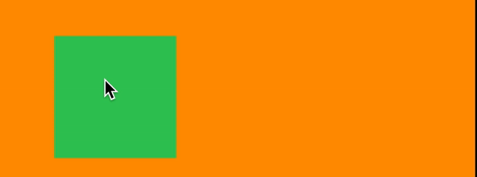
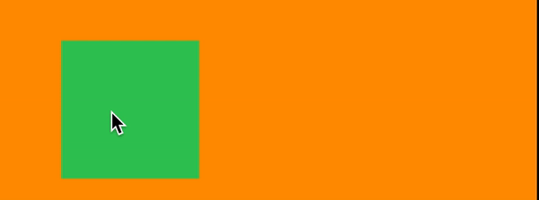
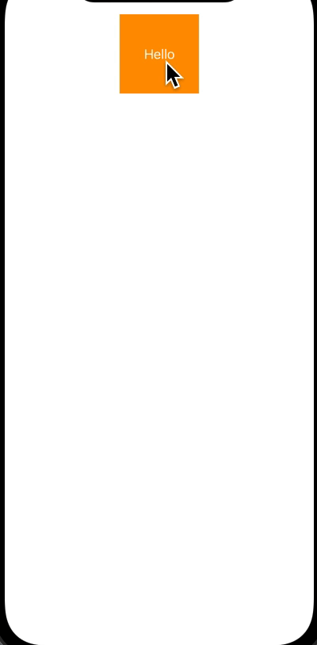

# Match Geometry Effect

From **iOS 14** apple include new modifier `matchedGeometryEffect`. This modifier helps developer to create some amazing view animation with few lines of code. All we need to do is describe the appeareance of two views  and use `.matchGeometryEffect` modifier to tell these two view are same. The modifier will then compute the difference betweem those two views and automativally animates the size or position changes. 

### Namespace
We require `@Namespace` to tell swiftui that two view are same that need to considered during view transaction.

# Example 1

### Shape Morphing

**Without Match Geomerty Effect**

In the below code we `toggle` state variable to change the position and shape of object by using `.cornerRadius` and `.offset` modifier. 

```swift

    @State var toggle: Bool = false
    var body: some View {
        
        VStack{
            Rectangle()
                .fill(Color.green)
                .frame(width:  100, height: 100)
                .cornerRadius(toggle ? 50 : 0)
                .offset(x: toggle ? 100 : -100)
                .animation(.default)
                .onTapGesture {
                    self.toggle.toggle()
                }
        }
        .frame(width: UIScreen.main.bounds.width, height: UIScreen.main.bounds.height)
        .background(Color.orange)
        .ignoresSafeArea()
    }
        
```


<br>

**With Match Geomerty Effect**

With the `matchedGeometryEffect` modifier, you no longer need to figure out these differences. All you need to do is describe two views: 
- one represents the start state and 
- the other is for the final state. 

`matchedGeometryEffect` will automatically interpolate the size and position between the views.


```swift
@State var toggle: Bool = false
    @Namespace var animation
    var body: some View {
        VStack{
            if toggle {
                Circle()
                    .fill(Color.green)
                    .matchedGeometryEffect(id: "animation", in: animation)
                    .frame(width:  100, height: 100)
                    .offset(x: 100)
                    .onTapGesture {
                        withAnimation(.default) {
                            self.toggle.toggle()
                        }
                    }
                
            }else{
                Rectangle()
                    .fill(Color.green)
                    .matchedGeometryEffect(id: "animation", in: animation)
                    .frame(width:  100, height: 100)
                    .offset(x: -100)
                    .onTapGesture {
                        withAnimation(.default) {
                            self.toggle.toggle()
                        }
                        
                    }
            }
        }
        .frame(width: UIScreen.main.bounds.width, height: UIScreen.main.bounds.height)
        .background(Color.orange)
        .ignoresSafeArea()
```
**Special Note**

- Note 1

In the above code if you comment out `.matchedGeometryEffect` you would get following result.

> .matchedGeometryEffect(id: "animation", in: animation)



- Note 2

We al need to ay attention on where to put the  `.matchedGeometryEffect` modifier. If you would have used  `.matchedGeometryEffect` modifier after size of position setup. View transaction won't work properly as we expect.

```swift
    .frame(width:  100, height: 100)
    .offset(x: -100)
    .matchedGeometryEffect(id: "animation", in: animation)
```


- Note 3 : Element vs Container

It is not recommended to use Matched Geometry Effect on containers like VStack, HStack and ZStack. Instead, you should use it on elements like shapes, texts and buttons. We will see the sample code in Example 2 below


# Example 2

**Element vs Container**

Let's first try add `.matchedGeometryEffect` modifier in container itself and see the result.  In below code we applied the `.matchedGeometryEffect` modifier to `VStack`. The final output kind of produce animation but not as we want.

```swift
@State var toggle: Bool = false
    @Namespace var animation
    
    var body: some View {
        
        ZStack{
            if !toggle {
                ScrollView{
                    VStack{
                        Text("Hello")
                            .foregroundColor(.white)
                    }
                    .matchedGeometryEffect(id: "transaction", in: animation)
                    .frame(width: 100, height: 100, alignment: .center)
                    .background(
                        Rectangle()
                            .fill(Color.orange)
                    )
                            
                }
            }else{
                VStack {
                    Text("Hello")
                        .foregroundColor(.white)
                }
                .matchedGeometryEffect(id: "transaction", in: animation)
                .frame(width: UIScreen.main.bounds.width, height: 400, alignment: .center)
                .background(
                    Rectangle()
                        .fill(Color.orange)
                )
            }
        }
        .animation(.spring(response: 0.5, dampingFraction: 0.7))
        .onTapGesture {
            self.toggle.toggle()
        }
```


<br><br>
Now let's apply `.matchedGeometryEffect` modifier to `Text` and `Shape` rather that to `VStack`.  The outpu produce smooth transaction for both background and text.

```swift

 @State var toggle: Bool = false
    @Namespace var animation
    
    var body: some View {
        ZStack{
            if !toggle {
                ScrollView{
                    VStack {
                        Text("Hello")
                            .foregroundColor(.white)
                            .matchedGeometryEffect(id: "text", in: animation)
                    }
                    .frame(width: 100, height: 100)
                    .background(
                        Rectangle()
                            .fill(Color.orange)
                            .matchedGeometryEffect(id: "background", in: animation)
                    )
                }
            }else{
                VStack {
                    Text("Hello")
                        .foregroundColor(.white)
                        .matchedGeometryEffect(id: "text", in: animation)
                }
                .frame(width: UIScreen.main.bounds.width, height: 400, alignment: .center)
                .background(
                    Rectangle()
                        .fill(Color.orange)
                        .matchedGeometryEffect(id: "background", in: animation)
                )
            }
        }
        .animation(.spring(response: 0.5, dampingFraction: 0.7))
        .onTapGesture {
            self.toggle.toggle()
        }
    }

```


<br><br>