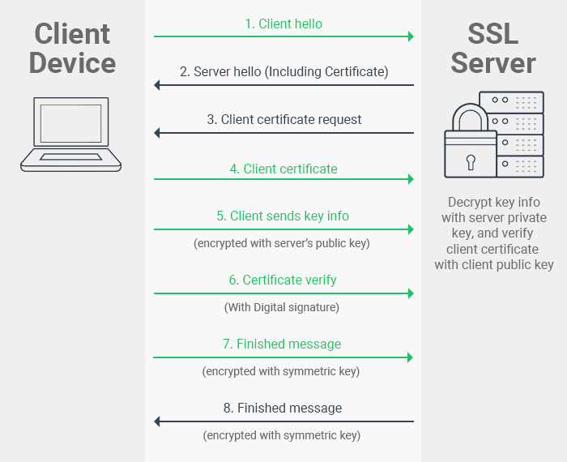

# SSL Pinning Or Public Key Pinning

Most of the client application (mobile apps, or a web client) get its data from server  over `https`.  When the ap exchange information, they typically use the `Transport Layer Security (TLS)` protocol to provide secure connection. Even if `TLS` protect the transmitted data from temparing, attackers can setup  `man-in-the-middle` attacks using self-signed certificates. With these certificate they can capture data moving to and from your apps. Detail tutorial on how we can use `man-in-the-middle` attack  here [Using Charles Proxy to Debug HTTPS connection](https://github.com/tigerraj32/Cheetsheet-Collection/blob/master/CharlesProxy.md)

To protect this `man-in-the-middle` attack it is required we imppement `SSL Certificate Pinning`.

**So what is `Certificate Pinning` ?**

`Certificate Pinning ` force your client application to validate the server's certificate agains a known copy of server certificaet while making secure communication with server. 


# How does SSL Works ?

There are multiple events occuring when making a single `https` connection.



- Client machine sends a connection request to server, server listens the request.
- Server gives response including public key and certificate.
- Client checks the certificate and sends a encrypted key to server.
- Server decrypt the key and sends encrypted data back to the client machine.
- Client receives and decrypt the encrypted data.


# Types  of SSL Pinning

- **Pin the certificate:**

   You can download the server’s certificate and bundle it into your app. At runtime, the app compares the server’s certificate to the one you’ve embedded. 
   
  - Disadvantage:
  
    This is not the preffred method for mobile application because typically every certificate have a validity life span. Once expired we need to renew or generate new one. This will require us to bundle this certificate in app again and release new build. If not done on time then app will stop working

- **Pin the public key:**
  
   You can retrieve the certificate’s public key and include it in your code as a string. At runtime, the app compares the certificate’s public key to the one hard-coded in your code.

  - Advantage

    This is the preffered method of `SSL Pinning` for mobile appilcation. Because the `public key hash` is never going to change.


# How to get SSL Certificate

Here I am going to demonstrate SSL Pinning for getting github repoitoty list using `github public api`.  There are multiple ways we can extract `Public SLL Certificate`

**Method 1:** From Browser

- Open the browser and hit `github.com`
- In the address bar you will see the lock icon indicating that this is a secure site.
- Click on this `lock icon`, this will open a window that shows the detail of certificate. 
- Click the `root certificate` and drag it to `Desktop`
- Now you have a `ssl certificate` which you can bundle into the application to implement `ssl pinning`


**Method 2:** From Terminal

We can use `openssl` and `s_client` to generate the certificate.   First of all copy and paste below command in terminal

```
openssl s_client -connect github.com:443 </dev/null  
```

Once it completes, you'll receive a lot of data including a list of certificates. Each certificate in the chain has a Common Name (CN).

```
Certificate chain
 0 s:/C=US/ST=California/L=San Francisco/O=GitHub, Inc./CN=github.com
   i:/C=US/O=DigiCert, Inc./CN=DigiCert High Assurance TLS Hybrid ECC SHA256 2020 CA1
 1 s:/C=US/O=DigiCert, Inc./CN=DigiCert High Assurance TLS Hybrid ECC SHA256 2020 CA1
   i:/C=US/O=DigiCert Inc/OU=www.digicert.com/CN=DigiCert High Assurance EV Root CA
```
Below that, you can see the actual certificate you're interested in, which is the one where CN is githubcom.

```
Server certificate
-----BEGIN CERTIFICATE-----
MIIFBjCCBK2gAwIBAgIQDovzdw2S0Zbwu2H5PEFmvjAKBggqhkjOPQQDAjBnMQsw
CQYDVQQGEwJVUzEXMBUGA1UEChMORGlnaUNlcnQsIEluYy4xPzA9BgNVBAMTNkRp
Z2lDZXJ0IEhpZ2ggQXNzdXJhbmNlIFRMUyBIeWJyaWQgRUNDIFNIQTI1NiAyMDIw
IENBMTAeFw0yMTAzMjUwMDAwMDBaFw0yMjAzMzAyMzU5NTlaMGYxCzAJBgNVBAYT
AlVTMRMwEQYDVQQIEwpDYWxpZm9ybmlhMRYwFAYDVQQHEw1TYW4gRnJhbmNpc2Nv
MRUwEwYDVQQKEwxHaXRIdWIsIEluYy4xEzARBgNVBAMTCmdpdGh1Yi5jb20wWTAT
BgcqhkjOPQIBBggqhkjOPQMBBwNCAASt9vd1sdNJVApdEHG93CUGSyIcoiNOn6H+
udCMvTm8DCPHz5GmkFrYRasDE77BI3q5xMidR/aW4Ll2a1A2ZvcNo4IDOjCCAzYw
HwYDVR0jBBgwFoAUUGGmoNI1xBEqII0fD6xC8M0pz0swHQYDVR0OBBYEFCexfp+7
JplQ2PPDU1v+MRawux5yMCUGA1UdEQQeMByCCmdpdGh1Yi5jb22CDnd3dy5naXRo
dWIuY29tMA4GA1UdDwEB/wQEAwIHgDAdBgNVHSUEFjAUBggrBgEFBQcDAQYIKwYB
BQUHAwIwgbEGA1UdHwSBqTCBpjBRoE+gTYZLaHR0cDovL2NybDMuZGlnaWNlcnQu
Y29tL0RpZ2lDZXJ0SGlnaEFzc3VyYW5jZVRMU0h5YnJpZEVDQ1NIQTI1NjIwMjBD
QTEuY3JsMFGgT6BNhktodHRwOi8vY3JsNC5kaWdpY2VydC5jb20vRGlnaUNlcnRI
aWdoQXNzdXJhbmNlVExTSHlicmlkRUNDU0hBMjU2MjAyMENBMS5jcmwwPgYDVR0g
BDcwNTAzBgZngQwBAgIwKTAnBggrBgEFBQcCARYbaHR0cDovL3d3dy5kaWdpY2Vy
dC5jb20vQ1BTMIGSBggrBgEFBQcBAQSBhTCBgjAkBggrBgEFBQcwAYYYaHR0cDov
L29jc3AuZGlnaWNlcnQuY29tMFoGCCsGAQUFBzAChk5odHRwOi8vY2FjZXJ0cy5k
aWdpY2VydC5jb20vRGlnaUNlcnRIaWdoQXNzdXJhbmNlVExTSHlicmlkRUNDU0hB
MjU2MjAyMENBMS5jcnQwDAYDVR0TAQH/BAIwADCCAQUGCisGAQQB1nkCBAIEgfYE
gfMA8QB2ACl5vvCeOTkh8FZzn2Old+W+V32cYAr4+U1dJlwlXceEAAABeGq/vRoA
AAQDAEcwRQIhAJ7miER//DRFnDJNn6uUhgau3WMt4vVfY5dGigulOdjXAiBIVCfR
xjK1v4F31+sVaKzyyO7JAa0fzDQM7skQckSYWQB3ACJFRQdZVSRWlj+hL/H3bYbg
IyZjrcBLf13Gg1xu4g8CAAABeGq/vTkAAAQDAEgwRgIhAJgAEkoJQRivBlwo7x67
3oVsf1ip096WshZqmRCuL/JpAiEA3cX4rb3waLDLq4C48NSoUmcw56PwO/m2uwnQ
prb+yh0wCgYIKoZIzj0EAwIDRwAwRAIgK+Kv7G+/KkWkNZg3PcQFp866Z7G6soxo
a4etSZ+SRlYCIBSiXS20Wc+yjD111nPzvQUCfsP4+DKZ3K+2GKsERD6d
-----END CERTIFICATE-----
subject=/C=US/ST=California/L=San Francisco/O=GitHub, Inc./CN=github.com
issuer=/C=US/O=DigiCert, Inc./CN=DigiCert High Assurance TLS Hybrid ECC SHA256 2020 CA1
```

To copy the certificate into a file, use openssl again. Repeat the previous command and pass its output to openssl x509, specify DER encoding and output it to a new file named github.com.der:

```
openssl s_client -connect github.com:443 </dev/null  | openssl x509 -outform DER -out github.com.der
```


# How Do I Pin Certs in My Mobile App?

### For iOS

First, add your certificate into your ios project.  

For this example I am going to make a call to `github api` to list the my repository. Here github uses SSL and now I want to pin github's ssl certificate when making https request. To get the certificate follow the above steps. Before we dive into coding,  let's first create github personal token to pass aithorization when making api calls. [Get Personal Token](https://github.com/tigerraj32/Cheetsheet-Collection/blob/master/git/git-token.md)

Now let's create a swift class `NetworkManager`

Refrences
- https://www.raywenderlich.com/1484288-preventing-man-in-the-middle-attacks-in-ios-with-ssl-pinning