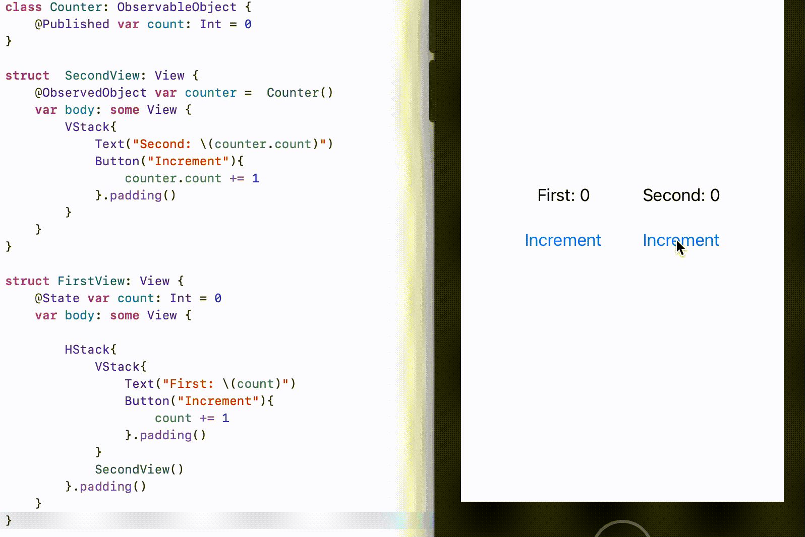
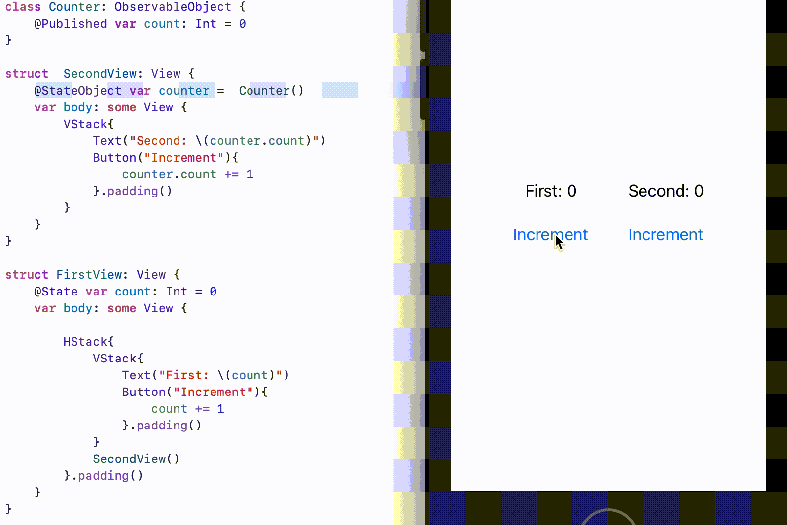

# @StateObject

`@StateObject` property wrapper is designed to fill a very specific gap in state management, when you need to create a refrence type inside one of your view and make sure it stays alive for use in that view and other views that it shares it.  It works similar to `@State` where `@State` is value type and `@StateObject` is refrence type.

For eg.

```swift
class Counter: ObservableObject {
    @Published var count: Int = 0
}

struct  SecondView: View {
    @StateObject var counter =  Counter()
    var body: some View {
        VStack{
            Text("Second: \(counter.count)")
            Button("Increment"){
                counter.count += 1
            }.padding()
        }
    }
}

struct FirstView: View {
    @State var count: Int = 0
    var body: some View {
        
        HStack{
            VStack{
                Text("First: \(count)")
                Button("Increment"){
                    count += 1
                }.padding()
            }
            SecondView()
        }.padding()
    }
}
```
SwiftUI creates a new instance of the object only once for each instance of the structure that declares the object. When published properties of the observable object change, SwiftUI updates the parts of any view that depend on those properties:


Previously we used `@ObservedObject` to get the same result, but this method resulted in destroying the refrence object and re initializze in some cases. 

### Result

**Result 1: Using @ObservedObject**




**Result 1: Using @StateObject**

