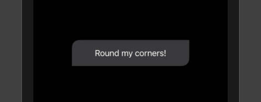

```swift
struct RoundedCornersShape: Shape {
    let corners: UIRectCorner
    let radius: CGFloat
    
    func path(in rect: CGRect) -> Path {
        let path = UIBezierPath(roundedRect: rect,
                                byRoundingCorners: corners,
                                cornerRadii: CGSize(width: radius, height: radius))
        return Path(path.cgPath)
    }
}
```

To use the above Shape

```swift
var body: some View {
    Text("Round my corners!")
        .padding()
        .padding(.horizontal, 30)
        .background(
            RoundedCornersShape(corners: [.topLeft, .bottomRight], radius: 15)
                .fill(Color(UIColor.systemGray4))
        )
}
```

> Prevew

