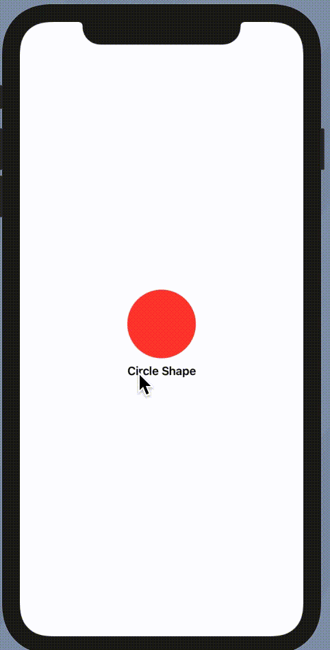

SwiftUI provides number of property wrapper for out application, each of which have different functionality. 

# Storing Long Term Data

SwiftUI provides three property wrapper designed to store and retrive data

- `@AppStorage`
- `@SceneStorage`
- `@FetchRequest`

## @AppStorage

`@AppStorage` is a property wrapper which is wrapped around `UserDefaults` for reading and writing data from and into the `UserDefaults`.  Every app has it own `@AppStorage` that can be accessed by any view within that application.This wrapper effectively watches a key in 'UserDefaults` and refreshed the view when 
that key is changed. You can take `@AppStorage` as `@State` which persist its data.

### Syntax

> @AppStorage("Key") private var Key: Type = Default Value


Below is the example that show and stores the number of count user pressed the button.

```swift
struct SampleView: View {
    @AppStorage("count") var count: Int = 0
    var body: some View {
        VStack {
            Text("Your count: \(count)")
            Button("Increase Count") {
                count += 1
            }
        }
    }
}
```

Initially the count is 0. Changing count above will cause the new value of count to be saved in `UserDefaults` with key count and refresh the current view. If we relaunch the application then deault value will be the last saved value.

### Using @AppStorage in multiple views

It's pretty simple to use `@AppStorage` in multiple views

```swift
struct SampleView: View {
    @AppStorage("count") var count: Int = 0
    var body: some View {
        VStack {
            Text("Your count: \(count)")
            Button("Increase Count") {
                count += 1
            }
        }
    }
}

struct SecondView: View {
    @AppStorage("count") var count: Int = 0
    
    var body: some View {
        VStack{
            Text("Your count: \(count)")
        }
    }
}
```

### Sharing data between application with @AppStorage

By default `@AppStorage` will watch `UserDefaults.standard`, but you can make it watch particular app group that allows us to share data between apps and app extension.  We do this by providing out own `UserDefault Store`. For this we need to create UserDefault with `suit name`

```swift
struct RootView: View {
    @AppStorage(
        "text",
        store: UserDefaults(suiteName: "group.yourapp.com")
    )
    private var text: String = ""
    
    var body: some View {
        TextEditor(text: $text)
            .padding()
    }
}
```


## @Namespace

Creates an animation namespace to allow matched geometry effects, which can be shared by other views. 
`match geometry effect` tells swiftui that these two view are same, which results in smooth animations

eg.

```swift
struct SampleView: View {
    @Namespace private var animation
    
    @State private var isFlipped = false
    var body: some View {
        VStack {
            if isFlipped {
                Circle()
                    .fill(Color.red)
                    .frame(width: 100, height: 100, alignment: .center)
                    .matchedGeometryEffect(id: "Circle", in: animation)
                
                Text("Circle Shape")
                    .font(.headline)
                    .matchedGeometryEffect(id: "Text", in: animation)
            }else{
                Text("Circle Shape")
                    .font(.headline)
                    .matchedGeometryEffect(id: "Text", in: animation)
                
                Circle()
                    .fill(Color.red)
                    .frame(width: 100, height: 100, alignment: .center)
                    .matchedGeometryEffect(id: "Circle", in: animation)
                
               
            }
           
        }.onTapGesture {
            withAnimation(){
                self.isFlipped.toggle()
            }
            
        }
    }
}
```


