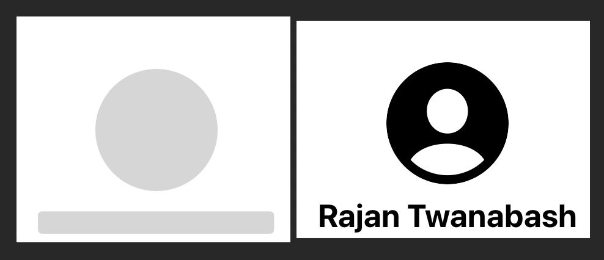
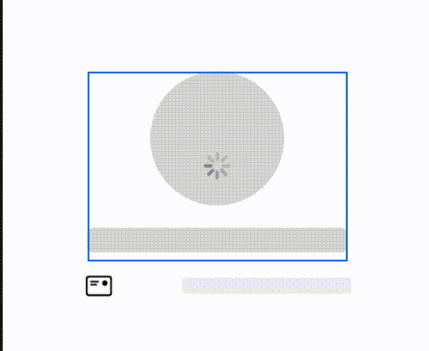

# Redacted

:edited especially in order to obscure or remove sensitive information
<br>

While displaying some content after calling api request, we can show the placeholder content until we receive the data. 
After we receive data then only we render the content. The way we display placeholder content before displaying actual content is called Redacted Views. 

Sample code
```swift 
Image(systemName:"person.crop.circle.fill")
                    .resizable()
                    .frame(width: 100, height: 100)
                    .clipShape(Circle())
                    .redacted(reason: .placeholder)
Text("Rajan Twanabash")
                    .font(.title)
                    .fontWeight(.bold)
                    .redacted(reason: .placeholder)
```


If we need to `unredacted` to specific view then we can use **unredacted()**

```swift
  Image(systemName: "mail").unredacted()
```

It is not convient to apply `redacted` to each and every view manually. Instead we can apply `redacted` modifier to the parent view.
This will apply redacted modifier to all it child view.

```swift
VStack{
        VStack{
            Image(systemName:"person.crop.circle.fill")
                .resizable()
                .frame(width: 100, height: 100)
                .clipShape(Circle())
            
            Text("Rajan Twanabash")
                .font(.title)
                .fontWeight(.bold)
            
        }
    }
    .redacted(reason: .placeholder)
```


Complete sample code that demonstrate data loading after 3 seconds
```swift
@State var isLoading:Bool = false
    var body: some View {
        VStack{
            VStack{
                Image(systemName:"person.crop.circle.fill")
                    .resizable()
                    .frame(width: 100, height: 100)
                    .clipShape(Circle())
                
                Text("Rajan Twanabash")
                    .font(.title)
                    .fontWeight(.bold)
                
            }
            VStack{
                HStack {
                    Image(systemName: "mail").unredacted()
                    Spacer()
                    Text("rajan@domain.com")
                        .foregroundColor(.gray)
                    
                }
            }.frame(width: 200)
        }
        .redacted(reason: isLoading ? .placeholder: [])
        
        .onAppear(){
            isLoading = true
            DispatchQueue.main.asyncAfter(deadline: .now() + 3) {
                isLoading = false
            }
        }
    }
  ```
