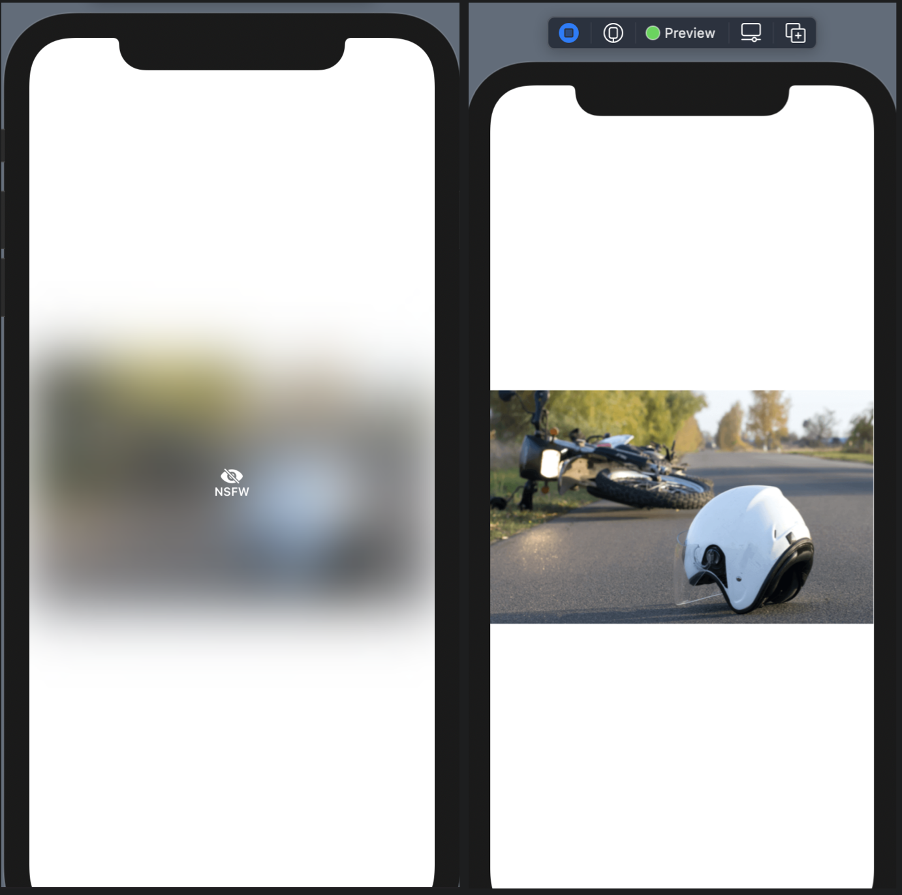

# ViewModifier

### Implementing Not Safe For Work (NSFW)

```swift
struct NSFW: ViewModifier {
    @State var isHide: Bool = true
    
    func body(content: Content) -> some View {
        ZStack(alignment: .center, content: {
            if isHide {
                content.layoutPriority(1)
                    .blur(radius: 30).clipped()
                VStack {
                    Image(systemName: "eye.slash.fill").foregroundColor(.white)
                    Text("NSFW").font(.caption).bold().foregroundColor(.white)
                }
            } else {
                content
            }
        }).onTapGesture {
            withAnimation {
                self.isHide = !self.isHide
            }
        }
    }
}

extension Image {
    func nsfw() -> some View {
        self.modifier(NSFW())
    }
}

struct SampleVew1: View {
    var body: some View {
        Image("accident-helpline")
            .resizable()
            .nsfw()
            .aspectRatio(contentMode: .fit)
        
    }
}
```

