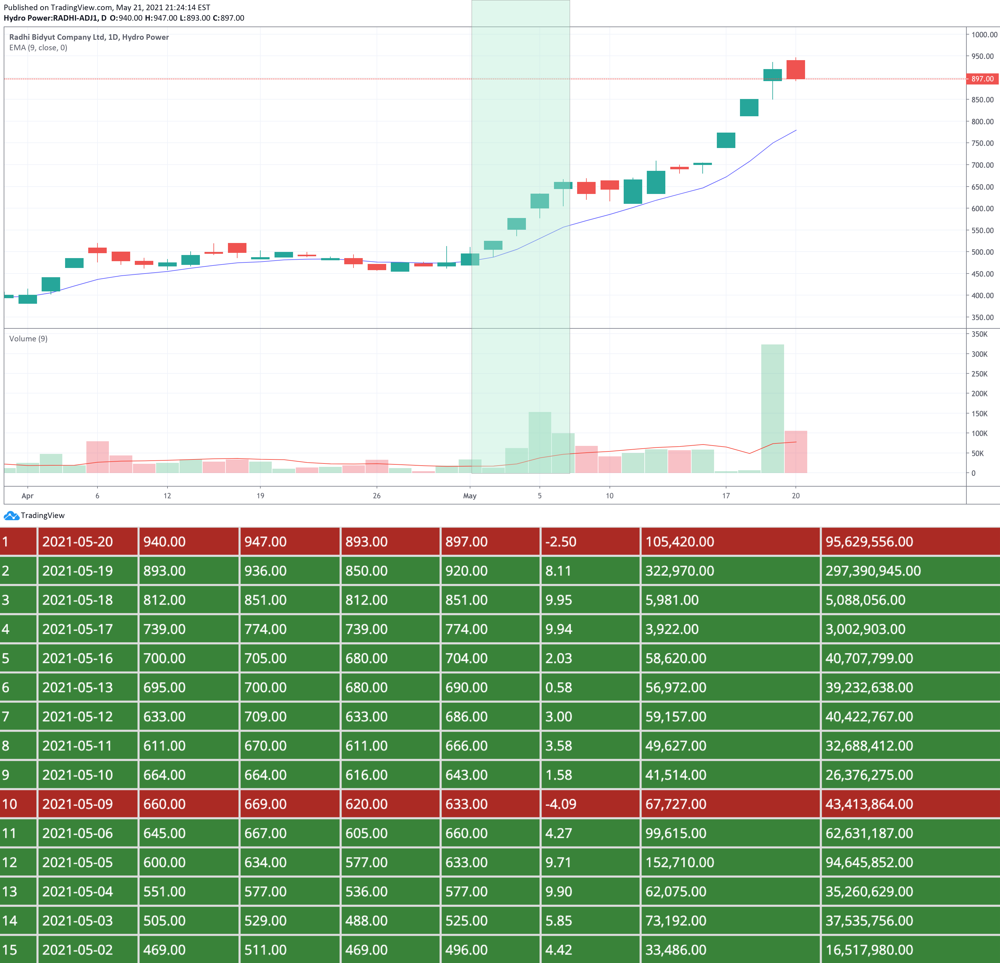
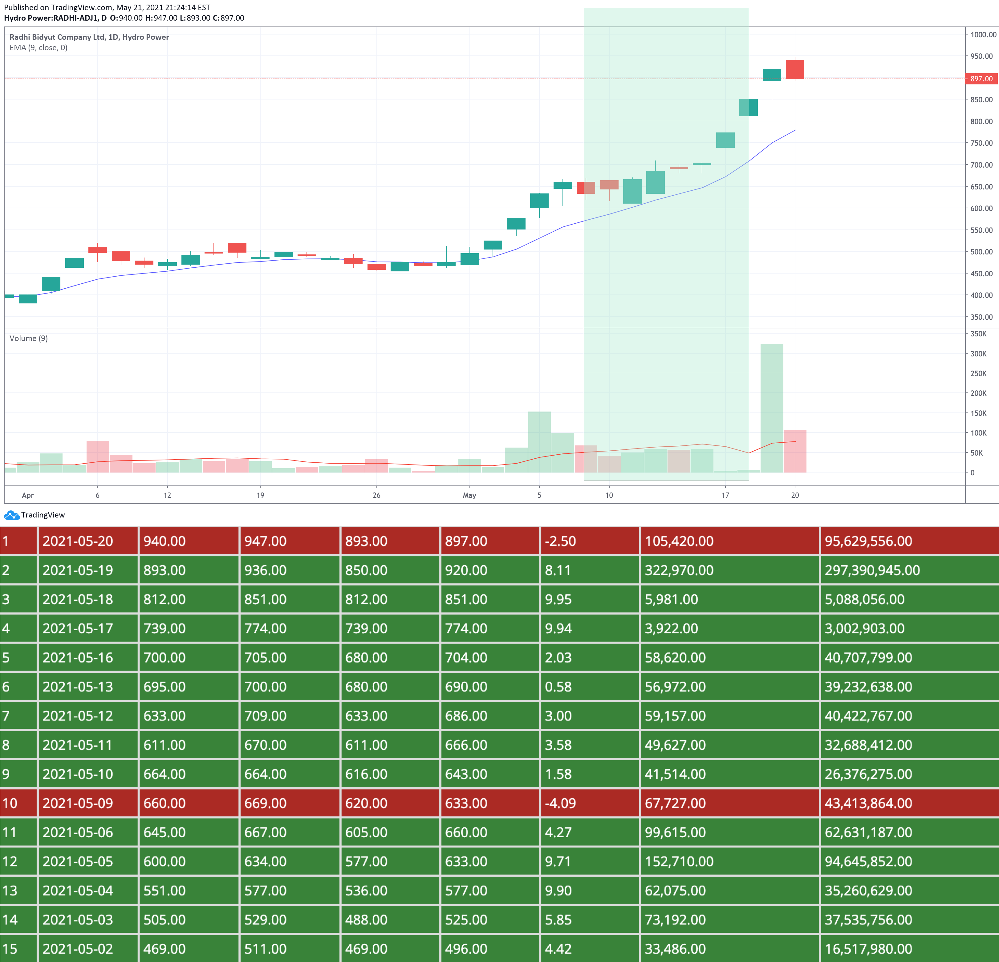
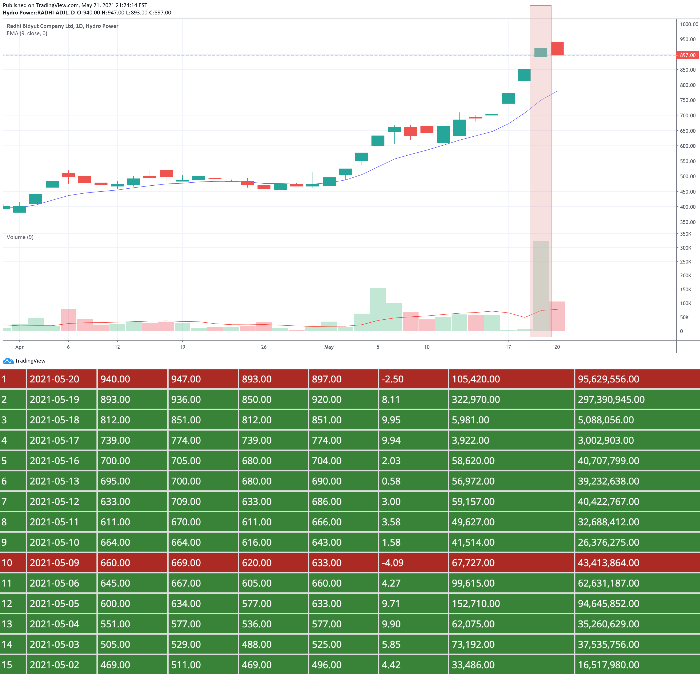

Before we dive into what actually is `swing trading` we need to understand what `Operator` and `Retailer` are in Stock Market. 

**Operator**
In common words the are called `big players` those who have lots of money of `luquidity`, So that the can influence the stock  for there sake of benefit.

**Retailer**
Those group of people who buy or sell stock in little volume in the hope of making some profit from share market and some time can be influence.

Let me show you how you can catch when the operator entered the market and leaved the market. If you can move along with them, then there is a high change that you 
make money with them or minimize the risk of loss.

## Scenerio 1
|Scenerio|Price|Volume|Operator Action|Retailer Action|Market Movement|
|--|--|--|--|--|--|
|Case 1| Increase | Increase| Entering| Waiting| Bullish |

Here the price as well volume is increasing which is the indication that operator have enter the market. While the retailer is at waiting state in the 
hope that price will decrease by some amount and buy. But they will never get that chance before this trend stops. So this is a clear indication that it's a 
BULLISH Trend.  And we should grab this opportunity and enter the market. 

**If we look at the above chart it is clear that both price and volume is increasing from May 2 to May 6.  This is a indication that trend will be `BULLISH`  and we need to enter at this point.**

   

## Scenerio 2
|Scenerio|Price|Volume|Operator Action|Retailer Action|Market Movement|
|--|--|--|--|--|--|
|Case 2| Increase | Decrease| Waiging For Exit| FOMO Entry| Bearish |

Here the price continue to increase but volume decrease. It means `Operator` is waiting for exit, but  `Retailers` are entering. Kind of FOMO (Fear Of Missing Out). They will thing price of this stock is increasing and if I don't enter now I may miss it. So they keep buying that stock.  `Operator` usually trade in huge volume where as `Retailers` trade in small small volume. Thats why even if `Retailer` are buying average volume shows decreasing. 

**If we look at the above chart it is clear that price is increasing and volume is decreasing from `May 9 to May 18`. This is a indication that will be `BEARISH` and we need to get out of it or at least stay in position to get out. **

   

## Scenerio 3
|Scenerio|Price|Volume|Operator Action|Retailer Action|Market Movement|
|--|--|--|--|--|--|
|Case 3| Decrease | Increase| Exiting| Waiting| Heavy Bearish |

Here price is decreasing but volume is increasing. This means `Operator` are silently moving out resulting in increase of volume and decrease of price Where are `Retailers` will be waiting for price to increase again. 

In above chart, price is not droping as expected but look at the volume that spikes up.  May be `Retailer` are not realising `Big Player` are moving out. Normally here price should have decrease. But some how it increasing. But if you look at the candle stick closely the closing price is less than the `Max High` for that day. 
Changes are `Operator` took there position are the closing hours. This is a clear indication that soon there will be a `Heavy Bearish` trend to follow.

   

##Scenerio 4
|Scenerio|Price|Volume|Operator Action|Retailer Action|Market Movement|
|--|--|--|--|--|--|
|Case 4| Decrease | Decrease| Already Exit| Panic Sell| Heavy Bullish |

Here both the price and volume is decreasing. It means `Operator` have already exited out  and `Retailers` are in Panic Mode due to sudden decrease in price and Volume. Thus they will even sell more to decrease loss. We normally call this `PANIC SELL`. Volume is not decreasing as expected for ovious reason as we explain in case 2.

In the above chart both price and volume is decreasing. Here `Operator`  will make there position to buy again at lower price. So this is a clear indication soon `Heavy Bearish` trend will follow.   So `Retailers` need to be alert and  prepare to enter once the trend switch to case 1 after this trend.

