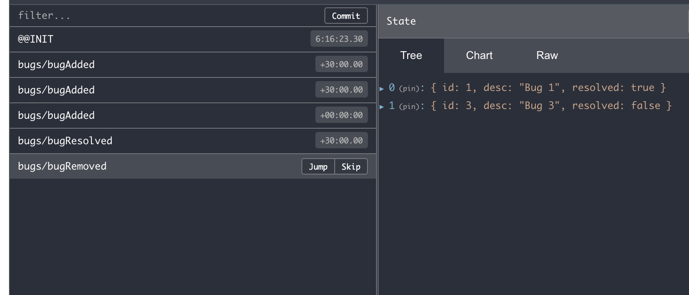
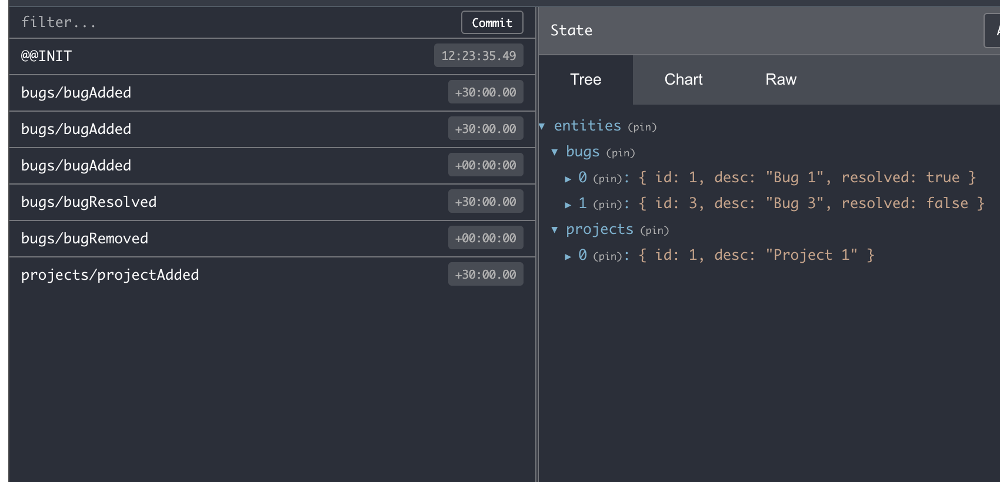

# Redux

## What is Redux ?

- Redux is state management library for  java script  such as react, angular, veu.
    
## When to use ?

- In a application that have complex UI, we need to listen to change in one part of UI and immediately need to change in another part of UI.

- The change in data can be because of network request  or background task or some asynchronous  task.

- Managing data  or state in such app is very complex with out state management solution. Some of  such state management solution are , 
    - Flux (created by Facebook)
    - Redux (inspired by Flux)
    - Mobx

## How redux works ?
   
- In redux instead of scattering the application state in various part of application UI, we store it in a central repository that is a single javascript object called store (a kind of database for front end)

- So different part of ui no longer need to maintain it own state instead they get or store in store.

- If something goes wrong, Redux can show how the change happened and why transparently.

- In short, Redux centralizes our application state and makes data flow transparent and predictable.


## Three Fundamental Principle in Redux

### Actoin

Actions are payloads of information that send data from your application to your store. They are the only source of information for the store. You send them to the store using  **store.dispatch().**

Actions are plain JavaScript objects. Actions must have a type property that indicates the type of action being performed. Types should typically be defined as string constants. Once your app is large enough, you may want to move them into a separate module.


- Action Types filename: **actionTypes.js**

```js
    export const ADD = 'bugAdded'
    export const REMOVED = 'bugRemoved'
    export const RESOLVED = 'bugResolved'
```        

- Action Creator filename: **action.js**

Action creators are exactly that—functions that create actions. In redux, action creators simply return an action

```js
    import * as  actionTypes from './actionTypes';

    export const bugAdded = (text) => {
        return { 
            type: actionTypes.ADD,
            payload: {
                desc: text
                }
            }
    }

    export const bugRemoved = (bugId) => ({
        
            type: actionTypes.REMOVED,
            payload: {
                id: bugId
            }
        
    })

    export const bugResolved = (bugId) => ({
        
        type: actionTypes.RESOLVED,
        payload: {
            id: bugId
        }

    })
```

### Reducer

Reducers specify how the application's state changes in response to actions sent to the store. Remember that actions only describe what happened, but don't describe how the application's state changes.

filename: **reducer.js**

```js

    import * as  actionTypes from './actionTypes';
     
     let lastID = 0

     const initialState = [
    {
        id: lastID,
        description: "",
        resolved: false
    }
]


export default function reducer(state = initialState, action) {

    switch (action.type) {
        case actionTypes.ADD: {
            return [
                ...state,
                {
                    id: ++lastID,
                    desc: action.payload.desc,
                    resolved: false
                }
            ];
        }

        case actionTypes.REMOVED: {
            return state.filter(bug => bug.id !== action.payload.id);
        }

        case actionTypes.RESOLVED: 
            //return state.map( bug =>  bug.id !== action.payload.id ? bug : {...bug, resolved: true})
            return state.map(bug => {
                if (bug.id !== action.payload.id){
                    return bug
                }else{
                    return {...bug, resolved: true}
                }
            })

    

        default: {
            return state
        }
    }

}
     
```

### Store 

The Store is the object that brings action and reducer together. The store has the following responsibilities:

    - Holds application state;
    - Allows access to state via getState();
    - Allows state to be updated via dispatch(action);
    - Registers listeners via subscribe(listener);
    - Handles unregistering of listeners via the function returned by subscribe(listener).

It's important to note that you'll only have a single store in a Redux application. When you want to split your data handling logic, you'll use **reducer composition** instead of many stores.

filename: **store.js**

```js
import {createStore} from 'redux'
import reducer from './reducer'
import {devToolsEnhancer} from 'redux-devtools-extension';
const store = createStore(
    reducer,
    //window.__REDUX_DEVTOOLS_EXTENSION__ && window.__REDUX_DEVTOOLS_EXTENSION__()
    devToolsEnhancer({trace: true})
    );

export default store;
```


### Redux in action

Filename: index.js

```js
import store from './store'
import {bugAdded,bugRemoved, bugResolved} from './actions'

//subscribe return function  to unsubscribe from subscription
const unsbuscribed = store.subscribe(() => {
    console.log("store changed ", store.getState());
})

store.dispatch(bugAdded("Bug 1"));
store.dispatch(bugAdded("Bug 2"));
store.dispatch(bugRemoved(2));
store.dispatch( bugResolved(1));
 

```


## Structuring Files and Folders

It will easy to follow the code if we could maintain the structure as following 

    - src
        - store
            - bug-feature
                - action.js
                - actionTypes.js
                - reducer.js


## Duck Pattern

One problem with about style of writing redux code is that every time we change some thing in bug-fearure, we need to touch 3 different files.  This will be difficult in large scale projects. So in duck pattern we combine all the action, acttionTypes and reducer in one file so that we don't need to jump into different files when we need to modify some thing.


    - src
        - store
            - bug.js
            -configureStore.js
    - index.js

FileName: **bug.js**
```js   
//action types
const ADD = 'bugAdded'
const REMOVED = 'bugRemoved'
const RESOLVED = 'bugResolved'


//action creators
export const bugAdded = (text) => {
    return { 
        type: ADD,
         payload: {
             desc: text
            }
        }
  }

export const bugRemoved = (bugId) => ({
    
        type: REMOVED,
        payload: {
            id: bugId
        }
    
 })

export const bugResolved = (bugId) => ({
    
    type: RESOLVED,
    payload: {
        id: bugId
    }

})

let lastID = 0

const initialState = [
    {
        id: lastID,
        description: "",
        resolved: false
    }
]

export default  function reducer(state = initialState, action) {

    switch (action.type) {
        case ADD: {
            return [
                ...state,
                {
                    id: ++lastID,
                    desc: action.payload.desc,
                    resolved: false
                }
            ];
        }

        case REMOVED: {
            return state.filter(bug => bug.id !== action.payload.id);
        }

        case RESOLVED: 
            //return state.map( bug =>  bug.id !== action.payload.id ? bug : {...bug, resolved: true})
            return state.map(bug => {
                if (bug.id !== action.payload.id){
                    return bug
                }else{
                    return {...bug, resolved: true}
                }
            })
        default: {
            return state
        }
    }

}


```


FIleName: **congigureStore.js**

```js
import { createStore} from 'redux'
import reducer from './bugs'

import {devToolsEnhancer} from 'redux-devtools-extension';

export default function configrireStore (){
    const store = createStore(
        reducer,
        devToolsEnhancer({trace: true})
        );

return store
}

```


Now in **index.js**

```js
import configureStore from './store/configureStore'
import * as actions from './store/bugs'


const store = configureStore();

const unsbuscribed = store.subscribe(() => {
    console.log("store changed ", store.getState());
})


store.dispatch(actions.bugAdded("Bug 1"));
store.dispatch(actions.bugAdded("Bug 2"));
store.dispatch(actions.bugRemoved(2));
store.dispatch(actions.bugResolved(1));

```


# Redux Toolkit

Redux toolkit provides bunch of features that helps writing redux  code easier.

### Installation

    # NPM
    npm install @reduxjs/toolkit

    # Yarn
    yarn add @reduxjs/toolkit


### Configure store using redux tool kit

A friendly abstraction over the standard Redux createStore function that adds good defaults to the store setup for a better development experience.

```js
//filename: congirureStore.js

import {configureStore} from '@reduxjs/toolkit'
import reducer from './bugs'

export default function() {
    return configureStore({
        reducer: reducer
    })
}
```

### Creating action  / reducer using redux toolkit

**createAction** is a helper function that create action. It return two properties
- type : that tell which action is triggred
- payload: that tells the payload to be used as action paramter.

```js 
//bugs.js

import { createAction, createReducer } from '@reduxjs/toolkit'

let lastID = 0
//create action
export const bugAdded = createAction("bugAdded");
export const bugResolved = createAction("bugAdded");
export const bugRemoved = createAction("bugAdded");

//reducer
//initial state, and action Handler as key value pair . Uses immer internally
export default createReducer([], {
    
    [bugAdded.type]: (bugs, action) => {
        bugs.push({
            id: ++lastID,
            desc: action.payload.desc,
            resolved: false
        })
    },

    [bugResolved.type]: (bugs, action) => {
        const index = bugs.findIndex(bug => bug.id === action.payload.id)
        bugs[index].resolved = true
    }, 
    [bugResolved.type]: (bugs, action) => {
        bugs.filter(bug => bug.id !== action.payload.id);
    }

})

```


### Creating slice in redux toolkit

**createSlice** is a function that accepts an initial state, an object full of reducer functions, and a "slice name", and automatically generates **action creators** and **action types**  that correspond to the **reducers** and **state**.

```js
//bugs.js

import {createSlice } from '@reduxjs/toolkit'

let lastID = 0

const slice  = createSlice({
    name: "bugs",
    initialState: [],
    reducers: {
        bugAdded: (bugs, action) =>{
            bugs.push({
                id: ++lastID,
                desc: action.payload.desctiption,
                resolved: false
            })
        },

        bugResolved: (bugs, action) => {
            const index = bugs.findIndex(bug => bug.id === action.payload.id)
            bugs[index].resolved = true
        },

        bugRemoved: (bugs, action) => {
            
            const temp = bugs.filter(bug => bug.id !== action.payload.id);
            console.log(temp);
            return temp;
        }
    }
})

console.log(slice);

export const {bugAdded, bugResolved, bugRemoved} = slice.actions
export default slice.reducer;
```




# Combine reducers

In a complex project it is  possible to use multiple slices of store such as

    {
        bugs: [],
        projects:[]
    }

It is good practise to put all these different piece of slices to single parent slices called **entities**   some thing like this,

    {
        entities: {
            bugs:[],
            projects:[]
        }
    }


Here's how we can 

**create slice for bugs**

```js
//bugs.js

import {createSlice } from '@reduxjs/toolkit'

let lastID = 0

const slice  = createSlice({
    name: "bugs",
    initialState: [],
    reducers: {
        bugAdded: (bugs, action) =>{
            bugs.push({
                id: ++lastID,
                desc: action.payload.desctiption,
                resolved: false
            })
        },

        bugResolved: (bugs, action) => {
            const index = bugs.findIndex(bug => bug.id === action.payload.id)
            bugs[index].resolved = true
        },

        bugRemoved: (bugs, action) => {
            
            const temp = bugs.filter(bug => bug.id !== action.payload.id);
            console.log(temp);
            return temp;
        }
    }
})

export const {bugAdded, bugResolved, bugRemoved} = slice.actions
export default slice.reducer;
```

**create slice for project**

```js
//project.js

//Create action with redux tool kit
import {createSlice } from '@reduxjs/toolkit'

let lastID = 0

const slice  = createSlice({
    name: "projects",
    initialState: [],
    reducers: {
        projectAdded: (projects, action) =>{
            projects.push({
                id: ++lastID,
                desc: action.payload.desctiption,
               
            })
        }
    }
})

export const {projectAdded} = slice.actions
export default slice.reducer;

```


**To combile slices**

```js
//configureStore.js


import {configureStore} from '@reduxjs/toolkit'
import {combineReducers} from 'redux'

import reducerBug from './bugs'
import reducerProject from './projects'


// bugs and project store
const reducers =  combineReducers({
    bugs: reducerBug,
    projects: reducerProject
})

//entities store
const entitiesReducer = combineReducers({
    entities: reducers
})

//root store
export default function() {
    return configureStore({
        reducer: entitiesReducer
    })
}


```

**Using combined reducer**

```js
//index.js

import configureStore from './store/configureStore'
import * as actions from './store/bugs'
import * as projectActions from './store/projects'


const store = configureStore();

const unsbuscribed = store.subscribe(() => {
    console.log("store changed ", store.getState());
})


store.dispatch(actions.bugAdded({desctiption: "Bug 1"}));
store.dispatch(actions.bugAdded({desctiption: "Bug 2"}));
store.dispatch(actions.bugAdded({desctiption: "Bug 3"}));
store.dispatch(actions.bugResolved({id:1}));
store.dispatch(actions.bugRemoved({id:2}));
store.dispatch(projectActions.projectAdded({desctiption: "Project 1"}))
```




## webpack-dev-server
    -  Development server that provides live reloading

Installation
```
npm install webpack-dev-server --save-dev
```

Start Dev server
- configuration file: webpack.config.js
```
npm start
```
