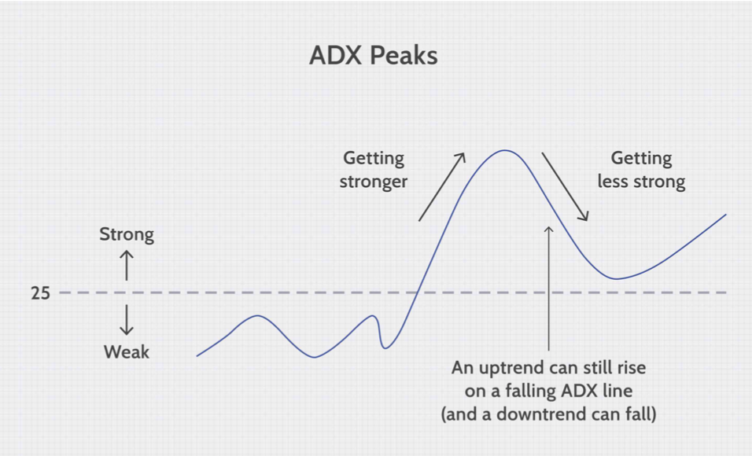
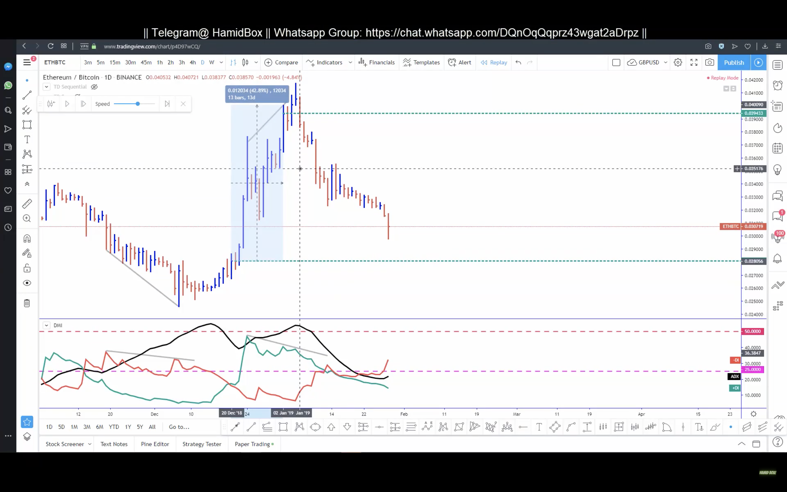
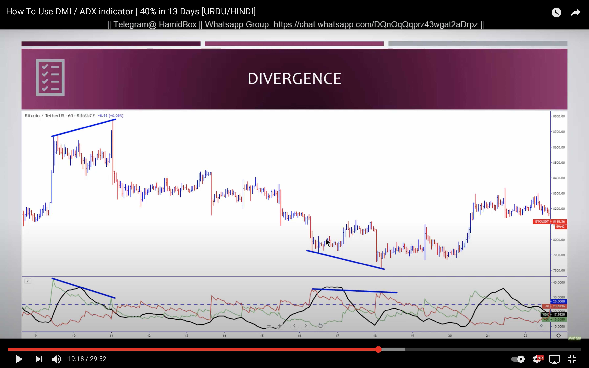

# Average Directional Index (ADX)

Trending in the direction of a strong trend reduces risk and increases profit potential.  `ADX` is used to determine when the price is trending strongly, be it bullish or bearish.

ADX calculations are based on a moving average of price range expansion over a given period. The default setting is 14 bars, although other periods can be used. ADX is plotted as a single line with values ranging from a low of zero to a high of 100. In most cases, 0 - 50 plays a great role.

### Quantifying Trend Strength

`ADX` values help traders identify the strongest and most profitable trend to trade.  It also helps us to distinguish between trending and nontrending conditions.

Most traders use the `ADX` reading above 25 to suggest that trend is strong and avoid trading when the `ADX` value is below 25.

|ADX Value| Trend Strength |
|--|--|
|   0-25    |   Weak Trend  |
|   25-50   |   Stong Trend |
|   50-75   |   Very Strong Trend |
|   75-100  |   Extremely Strong Trend  |

 

> Fig: Sample ADX

 

The above chart shows two distinct use cases for ADX (`strong up trend` and `strong downtrend`). 

- In the first example for a few bars price was falling. When the `ADX` value cross above 25, it is a signal that the trend will change in the coming days and the price did go up for quite a few days. The stronger the value of `ADX`, the uptrend is even stronger.
- In the second example when the `ADX` value crosses 25, the price trend drops sharply.  The stronger the value of `ADX`, the downtrend is even stronger. 
- Low `ADX` value is usually a sign of ranging and traders need to avoid trading at this point. When ADX is below 25 for more than 30 bars, price enters range conditions, and price patterns are often easier to identify. Price then moves up and down between resistance and support to find selling and buying interest, respectively. 

**Important Note**
- `'ADX` is a non-directional indicator. When the value goes up by 25 it does not always mean up-trend.  It just indicates that the current trend is getting stronger. It can be up-trend or down-trend.

- A falling ADX line only means that the trend strength is weakening, but it usually does not mean the trend is reversing unless there has been a price climax. Check below image 

- So we will use `MDI` to make appropriate decision later.

## Additional Use of ADX

### Trend Momentum

Te Series of `ADX` peaks are also visual representation of overall trend momentum. `ADX` clearly  indicates when the trend is gaining of losing momentum.  

- A series of higher HIGH peaks means trend momentum is increasing.

- A series of lower low  ADX peaks means trend is loosing momentum.

- Most importantantly ADX peans above 25 is consider strong. 

### Trend Momentum divergence

`ADX` can also show momentum `divergence`. When the pcie makes a higher high and `ADX` makes lower low , there is a negative divergence. This means price may going to drop soon. It is not a signal for a trend reversal but a warning that trend momentum is going to change.  This is appropriate time for  `book profit`.  It's a sell signal

Again if when the price is making lower low when `ADX` makes lower low, there is a negative divergence again. This means decrease  in price does not reflect the actual trend. This is a sigal price ma rise in near future. It's a Buy signal

> [Refrence Source](https://www.investopedia.com/articles/trading/07/adx-trend-indicator.asp)

#  Directional Movement Index (MDI) Introduction

- DMI shows Bullish and Bearish Pressure
- Trending | Ranging
- Entry | Exit
- Divergence

### Trending / Rannging

- Trending value : Above 25
- Ranging Value: Below 25
- Overbought / Oversold: 50 or 50+

- If ADX line falls below 25, price will consolidating (market ranging).
- IF ADX break through the 25 Price is entering into a new Trend
-